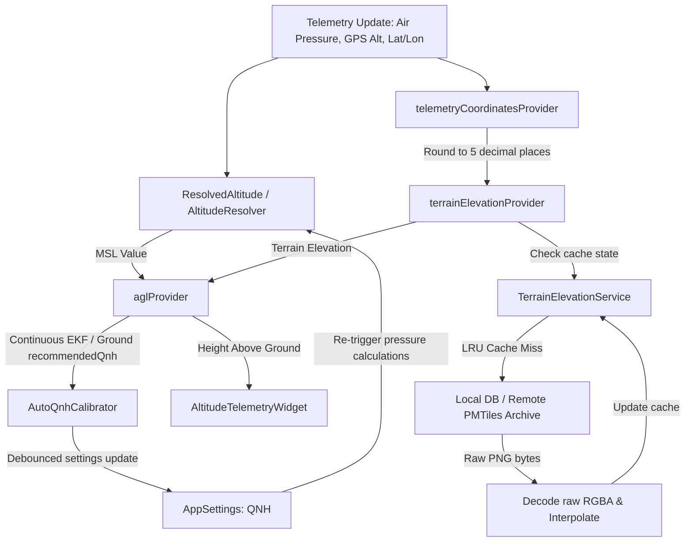

# Altitude Resolution and Terrain Elevation System

This document outlines the technical implementation of the altitude resolution, terrain elevation mapping, and automatic QNH calibration systems in the Stork application.

---

## 1. System Overview

To provide pilots with safe, accurate, and context-aware flight data, Stork resolves altitude dynamically from multiple physical and virtual sources. The system calculates:
- **Mean Sea Level (MSL) Altitude:** The altitude relative to sea level, adjusted either via GPS height or barometric pressure using local altimeter settings (QNH).
- **Flight Level (FL):** Standard pressure-altitude calculated relative to the standard pressure datum of 1013.25 hPa.
- **Height Above Ground Level (AGL):** The altitude above the terrain directly underneath the aircraft.
- **Automatic QNH Calibration:** Continuous calibration of the altimeter setting (QNH) on the ground (using terrain elevation) and in-flight (using a Kalman filter).

---

## 2. High-Level Architecture and Data Flow

The following diagram illustrates how telemetry data flows through the elevation and calibration systems to produce resolved altitudes and AGL displays:



---

## 3. Altitude Source Resolution

Because sensors can fail or drop offline, the [AltitudeResolver](../../lib/features/telemetry/domain/models/resolved_altitude.dart) dynamically selects the best available source according to a strict precedence chain.

### Precedence Rules

| Priority | Source | Indicator | Safety / Precision Rationale |
| :--- | :--- | :--- | :--- |
| **1 (Highest)** | Barometric (`AltitudeSource.baro`) | `airPressure != null` | Standard for aviation. Highly responsive to rapid pressure change. |
| **2** | DroneCAN GPS (`AltitudeSource.gpsDroneCan`) | `gpsAltitude != null && isGpsDroneCan == true` | External high-precision avionics GPS receiver. |
| **3** | Phone GPS (`AltitudeSource.gpsPhone`) | `gpsAltitude != null && isGpsDroneCan == false` | Fallback device-level GPS receiver. |
| **4 (Lowest)** | None (`AltitudeSource.none`) | All values null | Telemetry offline. |

### Mathematical Calculations

The barometric altitude formula is implemented in [AviationMath](../../lib/core/utils/aviation_math.dart) based on the **US Standard Atmosphere** model:

#### 1. Pressure to Altitude (MSL / FL)
Calculates altitude $h$ (in meters) for a measured air pressure $p$ (in Pa) and reference sea-level pressure $p_0$ (in hPa, e.g., QNH):

$$h = 44330.77 \times \left(1.0 - \left(\frac{p}{p_0 \times 100}\right)^{0.190263}\right)$$

*Note: The exponent $0.190263$ is the inverse barometric exponent ($1.0 / 5.255877$), derived from standard atmospheric constants: $g \cdot M / (R \cdot L)$.*

#### 2. Altitude to Reference Pressure (QNH)
Calculates QNH $p_0$ (in hPa) at a known elevation $h$ (in meters) for a measured pressure $p$ (in Pa):

$$p_0 = \frac{p / 100.0}{\left(1.0 - \frac{h}{44330.77}\right)^{5.255877}}$$

---

## 4. Terrain Elevation Engine

To support AGL calculations, Stork queries local terrain maps using [TerrainElevationService](../../lib/core/services/terrain_elevation_service.dart). 

### Tile Coordinate Mapping
Terrain data is indexed at **Web Mercator zoom level 12**. Longitude and latitude are converted to tile indices $(X, Y)$ and fractional pixel coordinates within the standard $256 \times 256$ pixel boundary using:

$$x_{\text{decimal}} = \frac{\text{lon} + 180}{360} \times 4096$$

$$y_{\text{decimal}} = \frac{1.0 - \ln\left(\tan(\text{lat}_{\text{rad}}) + \sec(\text{lat}_{\text{rad}})\right) / \pi}{2} \times 4096$$

### Mapzen Terrarium Format Decoding
Tiles are loaded as PNG images from the local SQLite database ([DatabaseService](../../lib/core/services/database/database_service_io.dart)) or the remote PMTiles archive fallback ([MapAssetsServer](../../lib/core/services/map_assets_server_io.dart)). The RGB channels encode elevation in the Mapzen Terrarium specification:

$$\text{elevation} = (R \times 256 + G + B / 256) - 32768$$

### Bilinear Interpolation
To prevent jagged elevation readings, the service samples the four closest pixel elevations around the fractional coordinate and performs bilinear interpolation:

```dart
// Interpolate along X axis
final double h0 = h00 + tx * (h10 - h00);
final double h1 = h01 + tx * (h11 - h01);
// Interpolate along Y axis
final double elevation = h0 + ty * (h1 - h0);
```

### Performance & Cache Optimizations

1. **Tile Cache:** A lightweight Least-Recently-Used (LRU) `TileCache` (capacity: 4 tiles) is used. It caches both decoded pixel arrays and **failed requests (as `null`)** to prevent repeating database/network lookups for areas without elevation data.
2. **Coordinate Rounding:** Telemetry coordinates are rounded to **5 decimal places (~1.1m precision)** by [telemetryCoordinatesProvider](../../lib/features/telemetry/presentation/providers/agl_provider.dart). This filters out high-frequency GPS noise fluctuations, preventing redundant cache inquiries and tile-reloading cycles.

---

## 5. Dynamic AGL Calculation

The [aglProvider](../../lib/features/telemetry/presentation/providers/agl_provider.dart) integrates the MSL altitude and the terrain elevation underneath the aircraft to construct the [AglState](../../lib/features/telemetry/presentation/providers/agl_provider.dart):

$$\text{Height Above Ground (AGL)} = \text{MSL Altitude} - \text{Terrain Elevation}$$

The computation is fully reactive. While terrain tiles are loading from disk/network, the provider signals `isFetching = true` to allow the UI to display appropriate indicators.

---

## 6. Auto-QNH Calibration

Altimeter settings can drift due to weather transitions. Stork features dual-mode automatic QNH calibration.

### 6.1. Ground Calibration
When the aircraft is stationary on the ground (`isFlying == false`), the calibrator computes the target QNH using the measured barometric pressure and the terrain elevation directly under the aircraft. It applies a **2-second debounce** before saving the QNH value to `AppSettings`.

### 6.2. In-Flight Calibration (2D Extended Kalman Filter)
In flight, terrain cannot be assumed as a fixed reference. Instead, the [AutoQnhCalibrator](../../lib/features/telemetry/presentation/providers/agl_provider.dart) deploys a **2D Extended Kalman Filter (EKF)** that continuously estimates both the true altitude ($H$) and sea-level pressure ($QNH$) simultaneously.

#### 1. State Variables
The state vector is $x = [H, QNH]^T$.

#### 2. Process Model (Prediction Step)
At each time step $dt$, process noise variances are propagated:
- **Altitude Process Noise rate ($Q_H$):** $100.0 \text{ m}^2/\text{s}$ (accounts for climbing or descending uncertainty).
- **QNH Process Noise rate ($Q_{QNH}$):** $2.5 \times 10^{-5} \text{ hPa}^2/\text{s}$ (accounts for slow barometric weather shifts).

The state covariance matrix $P$ updates as:

$$P_{11} \leftarrow P_{11} + Q_H \cdot dt$$

$$P_{22} \leftarrow P_{22} + Q_{QNH} \cdot dt$$

#### 3. Measurement Model (Update Step)
The filter accepts two observations:
1. **GPS Altitude** ($z_{\text{gps}}$) — direct observation of $H$.
2. **Measured Air Pressure** ($z_{\text{baro}}$) — non-linear function of $H$ and $QNH$:

$$\text{pred}_P = QNH \times 100 \times \left(1.0 - \frac{H}{44330.77}\right)^{5.255877}$$

The Jacobian $H_{\text{jac}}$ of the measurement model is:

$$H_{\text{jac}} = \begin{bmatrix} 1.0 & 0.0 \\ \frac{\partial P}{\partial H} & \frac{\partial P}{\partial QNH} \end{bmatrix}$$

where:

$$\frac{\partial P}{\partial H} = -\frac{5.255877 \times \text{pred}_P}{44330.77 - H}$$

$$\frac{\partial P}{\partial QNH} = \frac{\text{pred}_P}{QNH}$$

#### 4. Measurement Noise
- **Barometer Noise Variance ($R_{\text{baro}}$):** Fixed at $4.0 \text{ Pa}^2$ (standard deviation of $2.0 \text{ Pa}$).
- **GPS Noise Variance ($R_{\text{gps}}$):** Equal to the square of the vertical accuracy reported by the GPS receiver ($z_{\text{gps\_accuracy}}^2$).

#### 5. EKF Safety Filtering & Debouncing
- **GPS Verification:** GPS observations are ignored if the vertical accuracy falls outside the safe bounds of $[1.0\text{m}, 20.0\text{m}]$.
- **Settings Save Debounce:** To prevent excessive write cycles to persistent storage, estimated QNH changes are throttled:
  - Only written if the difference exceeds $0.1 \text{ hPa}$.
  - Debounced to write at most once every **15 seconds** during flight.

---

## 7. UI and Settings Integration

The frontend exposes altitude options cleanly using modern typography, glassmorphism, and intuitive controls.

### UI Components

1. **[TelemetryCard](../../lib/features/telemetry/presentation/widgets/telemetry_card.dart):** A reusable, glassmorphic layout container featuring 10px backdrop filters (`ImageFilter.blur`) and dynamic borders that adapt to the dark/light mode context.
2. **[AltitudeTelemetryWidget](../../lib/features/telemetry/presentation/widgets/altitude_telemetry_widget.dart):** Positioned on the map, it shows MSL (or FL) in monospace font, and shows a secondary AGL reading (e.g. `240 ft AGL`) when terrain data is resolved.
3. **[AltitudeDetailsDialog](../../lib/features/telemetry/presentation/dialogs/altitude_details_dialog.dart):** Tap gesture on the card opens this dialog, containing:
   - Visual source indicator (Barometer, GPS receiver, or Phone GPS).
   - Terrain elevation readouts.
   - Auto-QNH toggle. When disabled, manual adjustment spinners and numeric inputs appear, allowing exact hPa overrides bounded by $[800.0, 1200.0]$ hPa.
4. **[FlightSettingsPage](../../lib/features/settings/presentation/pages/flight_settings_page.dart):** Provides selectors for units:
   - **Altitude Units:** `Meters MSL`, `Feet MSL`, or `Flight Level (FL)`.
   - **Height Units (AGL):** `Meters GND` or `Feet GND`.

---

## 8. Test Coverage and Verification

The system is validated under [terrain_elevation_test.dart](../../test/core/services/terrain_elevation_test.dart) across multiple domains:

1. **Projection Math:** Verifies Web Mercator conversion at coordinates $(0,0)$ matching zoom level 12 boundaries.
2. **Terrarium Decode:** Simulates raw color arrays and verifies height values for sea level, Mt. Everest ($8848.0\text{ m}$), and negative heights (Dead Sea).
3. **Bilinear Interpolation:** Ensures linear sampling between adjacent pixels accurately interpolates sub-pixel coordinates.
4. **Cache & LRU Eviction:** Simulates loading limits to verify oldest entries are evicted, and checks that failed fetches are cached as `null` to protect network/database bandwidth.
5. **Coordinate Rounding:** Asserts that coordinates changing by less than 5 decimal places do not trigger cache inquiries.
6. **Kalman Filter (EKF):** Simulates flight conditions to verify that estimated QNH converges dynamically, and that GPS measurements with vertical accuracy outside the $[1\text{m}, 20\text{m}]$ bounds are ignored.
