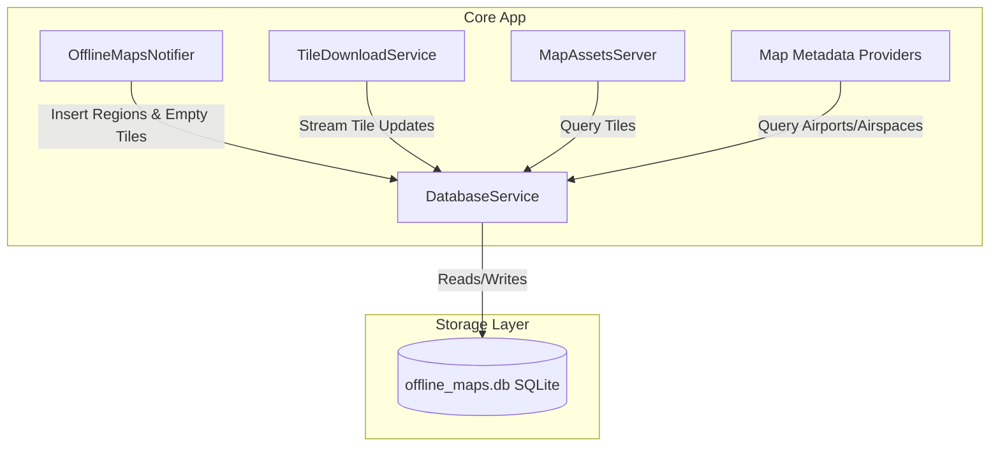

# Local Data Storage & Database Architecture

This document describes the design, schema definitions, performance optimizations, and transactional processing loops of Stork's local SQLite database system.

---

## 1. System Overview

Stork employs an offline-first architecture for map imagery and aeronautical data. To support smooth rendering and queries while in flight (where network connectivity is unavailable or unreliable), the system persists downloaded map regions, vector tiles, raster terrain elevations, and high-detail openAIP metadata features inside a local SQLite database.

The local storage system is managed by the [DatabaseService](../../lib/core/services/database/database_service.dart) wrapper. 



---

## 2. Platform-Specific Implementations

The database service uses Dart's conditional compilation to adapt to target runtimes:
- **IO Platforms (Android, iOS, Desktop)**: Implemented in [database_service_io.dart](../../lib/core/services/database/database_service_io.dart) using the native `sqlite3` driver bindings. The database file is stored persistently as `offline_maps.db` inside the system application support directory (`getApplicationSupportDirectory()`).
- **Web Platform**: Implemented in [database_service_web.dart](../../lib/core/services/database/database_service_web.dart). Since SQLite is not natively supported in the web browser environment, the database actions are implemented as stubs/no-ops. The web application operates in an online-only mode, loading styles, tiles, and metadata dynamically from remote archives.

---

## 3. Schema Design and Tables

During initialization on IO platforms, the database engine configures the tables and indices:

```sql
CREATE TABLE IF NOT EXISTS offline_regions (
    id TEXT PRIMARY KEY,
    downloaded_at DATETIME,
    min_lat REAL NOT NULL,
    min_lon REAL NOT NULL,
    max_lat REAL NOT NULL,
    max_lon REAL NOT NULL
);

CREATE TABLE IF NOT EXISTS map_tiles (
    z INTEGER NOT NULL,
    x INTEGER NOT NULL,
    y INTEGER NOT NULL,
    kind TEXT NOT NULL,
    tile_id INTEGER,
    tile_type TEXT NOT NULL,
    tile_data BLOB NOT NULL,
    PRIMARY KEY (z, x, y, kind)
);

CREATE TABLE IF NOT EXISTS openaip_features (
    id TEXT NOT NULL,
    json TEXT NOT NULL,
    country TEXT NOT NULL,
    type TEXT NOT NULL,
    PRIMARY KEY (id, type)
);
```

### 3.1. `offline_regions` Table
Stores geographical boundaries (bounding boxes defined by Northwest and Southeast coordinates) for the user-selected offline map areas.
- `id`: Unique UUIDv4 identifier.
- `downloaded_at`: The timestamp when the download completed.
- `min_lat`, `min_lon`, `max_lat`, `max_lon`: Bounding coordinates defining the geographical region.

### 3.2. `map_tiles` Table
Caches base vector map tiles, aeronautical vector tiles, and terrain elevation raster tiles.
- `z`, `x`, `y`: The standard Web Mercator coordinates of the tile.
- `kind`: The map source layer class:
  - `protomaps`: Vector base map tiles (max zoom 14).
  - `openaip`: Vector aeronautical metadata tiles (max zoom 14).
  - `terrain`: Raster terrain elevation tiles in Mapzen Terrarium PNG format (max zoom 12).
- `tile_id`: Calculated PMTiles-specific unique index (`ZXY.toTileId()`) corresponding to the tile position.
- `tile_type`: The content type extension (`pbf` for vector tiles, `png` for terrain raster tiles).
- `tile_data`: Raw compressed bytes of the downloaded tile. Empty tiles are stored with zero-byte arrays (`Uint8List(0)`) to act as placeholders before they are downloaded.

### 3.3. `openaip_features` Table
Caches parsed airports (`type: 'apt'`) and airspaces (`type: 'asp'`) details in standard GeoJSON formats.
- `id`: The unique feature identifier from openAIP.
- `json`: The full serialized properties and coordinates of the feature.
- `country`: The ISO country code (e.g. `SK`, `CZ`, `AT`) of the feature, parsed from the containing vector tiles.
- `type`: The metadata type selector (`apt` or `asp`).

---

## 4. Indexing Optimizations

To maintain high performance on low-end mobile hardware, Stork implements specific indices to accelerate reading and sorting:

1. **`idx_tiles_zxyk`** on `map_tiles (z, x, y, kind)`:
   - **Purpose**: Maximizes performance of the transparent local asset proxy ([MapAssetsServer](../../lib/core/services/map_assets_server_io.dart)). When MapLibre requests a map tile, the local HTTP server intercepts the coordinate query and performs a quick lookup using this index to see if the cached tile data exists.
2. **`idx_tiles_kind_id`** on `map_tiles (kind, tile_id)`:
   - **Purpose**: Optimizes the batch download system ([TileDownloadService](../../lib/core/services/tile_download_service_io.dart)). During a download phase, the service fetches empty tiles (`length(tile_data) = 0`) sorted by their PMTiles archive file offsets (`tile_id`). This allows the download engine to run sequential HTTP range requests efficiently.
3. **`idx_openaip_country_type`** on `openaip_features (country, type)`:
   - **Purpose**: Speeds up coordinate tapping and bounding queries. It optimizes looking up the stored features list by country and category.

---

## 5. Transaction & Batch Processing Mechanics

Writing to disk sequentially on mobile platforms is a slow operation. To prevent database I/O from choking the CPU or freezing the main thread, Stork employs batch operations wrapped inside transactions:

### 5.1. Batched Preparation
During `OfflineMapsNotifier.startDownload()`, the system calculates all coordinates inside the target bounding box and inserts placeholder tiles into the database:
- The [DatabaseService.insertEmptyTiles](../../lib/core/services/database/database_service_io.dart) prepares a single SQL statement.
- It begins a transaction (`BEGIN TRANSACTION`), runs all insertions sequentially, and commits the operations (`COMMIT`) once complete.
- Overlapping tile coordinates are filtered via `INSERT OR IGNORE`.

### 5.2. Download Update Loop (Batches of 50)
The download updates are handled in a producer-consumer model:
- `TileDownloadService` runs downloads concurrently for different kinds of tiles.
- As tiles are parsed, they are written to a stream.
- A consumer process (`_runDatabaseUpdateLoop`) buffers these results. When the buffer accumulates **50 updates**, it flushes them inside a single SQLite transaction using `DatabaseService.updateTilesData`.
- This transaction-based approach reduces SQLite file locking overhead and prevents UI stutter.
