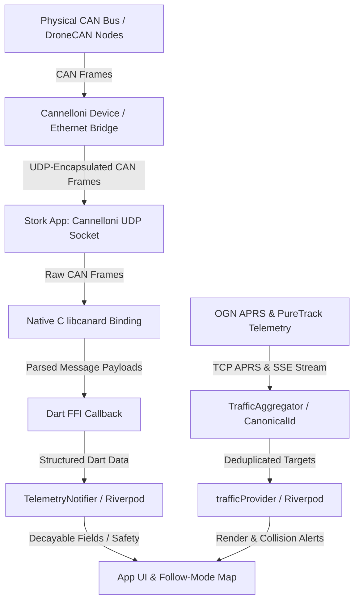

# Telemetry and Network Architecture

This document describes the high-performance telemetry, DroneCAN integration, and IP-encapsulated CAN network architecture in the Stork application.

---

## 1. High-Level Architecture

Stork uses an advanced, robust, and real-time telemetry pipeline to ingest flight, engine, and traffic data. Onboard hardware and avionics communicate using **CAN / DroneCAN** buses, bridged over Wi-Fi/Ethernet via **CAN-over-IP (Cannelloni)**. In parallel, external air-traffic situational telemetry is continuously ingested from multi-source traffic networks (**OGN APRS** and **PureTrack SSE stream**), aggregated, and deduplicated in real time.

The telemetry pipeline consists of the following layers:



---

## 2. Cannelloni Service (CAN-over-IP)

To communicate with a remote CAN bus, the application implements the client side of the **Cannelloni** protocol. Cannelloni encapsulates raw CAN frames inside UDP datagrams, allowing low-latency, real-time wireless telemetry over Wi-Fi or Ethernet.

### Socket Management
The system is managed by [CannelloniService](../../lib/core/services/cannelloni_service_io.dart) (a Riverpod provider):
- **Dynamic Connection**: It listens to settings changes ([appSettingsProvider](../../lib/features/settings/presentation/providers/settings_provider.dart)). When a target device is selected, it binds to a local UDP socket on an ephemeral port and connects to the target IP and port.
- **Bi-Directional Sockets**: Using a `RawDatagramSocket`, it listens asynchronously for incoming packets, extracts payload chunks, and immediately forwards them to the native C layer for processing.

### Connection Resilience

UDP over Wi-Fi is inherently unreliable — packets can be dropped, and sockets can die silently (e.g., OS background suspension, network interface reset). Stork implements a layered defence against these failures:

#### Grace Period (3000 ms)
When mDNS reports the device as unavailable (`_isDiscovered = false`) but the UDP socket is still receiving data, the service waits a **grace period of 3000 ms** before disconnecting. Each received packet resets this timer.

| Parameter | Value | Rationale |
| :--- | :--- | :--- |
| Data interval | ~1000 ms | DroneCAN `NodeStatus` broadcasts at 1 Hz |
| Grace period | 3000 ms | Tolerates **2 consecutive lost UDP packets** on unreliable Wi-Fi |

#### Silent Socket Detection (`onDone`)
A `RawDatagramSocket` stream can end without an explicit error — for example, when the OS suspends the app or the network interface goes down. The service registers an **`onDone` handler** on the socket listen stream. If the stream terminates unexpectedly, the connection state is immediately cleaned up, preventing the app from hanging in a "connected but dead" state.

#### Receive Watchdog (5 seconds)
As an independent safety net (decoupled from mDNS), a periodic **watchdog timer** checks every second whether data has been received within the last **5 seconds**. If no data arrives within this window — regardless of mDNS status — the service automatically triggers a full reconnect (`_connect`). This guards against scenarios where mDNS still sees the device but the data stream has stalled.

### TX Processing Queue (10Hz)
To ensure reliable frame delivery and prevent network congestion, outbound messages are processed in a periodic loop:
- A `Timer` runs at **10Hz** (every 100ms on IO platforms).
- In each tick, the service invokes the native [storkCanardGenerateTxPacket](../../src/native/stork_canard.c) to check if any outbound DroneCAN frames are queued in the native heap.
- If frames are ready, they are packaged into a UDP payload and transmitted to the remote bridge.

---

## 3. Multicast DNS (mDNS) Service Discovery

To avoid forcing users to manually input IP addresses or port numbers, Stork integrates an automated network discovery mechanism using Multicast DNS.

### Scan Procedure
The scan runs via the [discoveredDevices](../../lib/core/services/mdns_service.dart) stream provider:
1. **Service Type**: The service searches for `_cannelloni._udp.local` PTR records on the local subnet.
2. **Filtering**: It filters the results to match instances with the prefix `avionics-dronecan.` to ensure it only registers compatible bridges.
3. **SRV & IP Records**: For each discovered pointer, it retrieves:
   - The SRV record (containing the port and target hostname).
   - The IPAddress record (translating the hostname into a reachable IPv4 address).
4. **Periodic Refresh**: The stream yields results immediately upon initialization and schedules automatic sub-network rescans every **10 seconds** to detect when bridges go offline or new ones join.

---

## 4. Dynamic Node ID Allocation (DNA)

DroneCAN requires each node on the bus to have a unique numeric ID (1 to 127). Newly connected devices initially participate as anonymous nodes (Node ID `0`). Stork includes a full implementation of the **Dynamic Node ID Allocation (DNA)** protocol to claim a valid ID.

### DNA Protocol Workflow
1. **Anonymity**: Upon startup or socket reconnection, the app initializes the native stack with Node ID `0`.
2. **Persistent Unique ID (UUID)**: To identify itself uniquely across sessions, Stork generates a persistent 16-byte random UUID and stores it in `SharedPreferences`.
3. **Request Loop**: [DnaAllocationHandler](../../lib/core/services/dna_allocation_service.dart) begins broadcasting allocation requests containing slices of its UUID.
   - **T_request**: The initial request is sent after a random delay between 600 ms and 1000 ms to prevent network startup collisions.
   - **T_followup**: If a partial matching confirmation is received from the allocation server, a follow-up request is scheduled quickly (between 0 ms and 400 ms) to claim the ID.
4. **Collision Avoidance (Rule C)**: If the app detects DNA activity or allocation messages belonging to *other* nodes on the bus, it backs off and restarts its request timer to avoid colliding with other initializing devices.
5. **Confirmation**: Once the server allocates a Node ID and confirms the full 16-byte UUID, the handler switches `CannelloniService` to the allocated ID via [storkCanardInit(allocatedNodeId)](../../src/native/stork_canard.c) and begins active broadcasting.

---

## 5. Native DroneCAN Integration (FFI & C `libcanard`)

The core decoding and encoding of DroneCAN messages is implemented in C using a custom wrapper around [libcanard](../../src/native/stork_canard.c). This is bound to Dart via `dart:ffi`.

### Initialization & Callbacks
During startup, `CannelloniService` loads the native library and performs three main registrations:
1. **Log Callback**: Routes nitty-gritty native C logs into the Dart console with a `[stork_canard]` prefix.
2. **Transfer Callback**: Executed whenever the native C layer successfully reassembles a multi-frame DroneCAN message.
3. **Accept Callback**: Validates incoming message signatures and filters messages the app is interested in, preventing CPU overhead from irrelevant frames.

### Handled Messages

| Message Name | Message ID | Signature | Purpose in Stork |
| :--- | :--- | :--- | :--- |
| **`DynamicNodeIdAllocation`** | `1` | `0x1E1E6F37F15D7C81` | Manages node address resolution. |
| **`GetNodeInfo` (Request/Response)** | `430` | `0xEE468A80E6174A7C` | Allows other nodes to query the app's software version/UID. |
| **`NodeStatus`** | `341` | `0x0F0877D1C67EAE9B` | Broadcasts the app's health and uptime (1Hz). |
| **`StaticPressure`** | `1030` | `0x3E10E45E8D2E12F5` | Feeds barometric altitude data to the telemetry notifier. |
| **`Fix2`** | `1063` | `0xCA41E7000F37435F` | Decodes high-accuracy GPS/GNSS telemetry data (latitude, longitude, heading, ground speed, altitude, satellite count, accuracy). |
| **`IceStatus`** | `1120` | `0xD38AA3EE75537EC6` | Decodes engine status, including oil temp/pressure, coolant temp, fuel rates, CHTs, and EGTs. |
| **`FuelTankStatus`** | `1129` | `0x286B4A387BA84BC4` | Decodes fuel tank levels, volumes, consumption rates, and temperatures. |
| **`IndicatedAirspeed`** | `1021` | `0x0A1892D72AB8945F` | Decodes indicated airspeed (IAS) from pitot-static system — feeds `indicatedAirSpeed` telemetry field. |
| **`StorkEngineRpm`** | `20120` | `0xD8CD8D1076CA4884` | Decodes custom engine speed (RPM), load, throttle position, and ECU index. |
| **`VhfRadioFastStatus`** | `20122` | `0x5C070F2D19DBC8F1` | Fast VHF radio status — TX/RX/DUAL/Error flag bits. |
| **`VhfRadioFullStatus`** | `20123` | `0x77FF345C05600F4F` | Full VHF radio status — active/standby frequencies (kHz), station names, volume, squelch, VOX, intercom, microphone gains. |
| **`VhfRadioControl` (Request/Response)** | `221` | `0xB15B04E1F5473B6C` | DroneCAN service for controlling VHF radio — set frequencies, flip active/standby, adjust volume/squelch/VOX/intercom/mic gain, toggle dual watch, PTT. |

### 5.1. Cannelloni Service Request/Response Pattern

The Cannelloni service supports bidirectional DroneCAN service calls (request/response) in addition to one-way message publishing. This is used by the VHF radio control feature.

The `sendRequest` method in [CannelloniService](../../lib/core/services/cannelloni_service_io.dart) tracks pending requests with:

- **A `Completer<Uint8List>`**: Resolves when the matching response frame arrives from the DroneCAN node.
- **A `Transfer ID`**: Uniquely identifies the request to match the response.
- **A `Timeout Timer`** (default 1 second): If the node does not respond within the timeout window, the completer completes with a `TimeoutException`.

```dart
// Example: Sending a DroneCAN service request
final response = await cannelloni.sendRequest(
  destinationNodeId: nodeId,
  dataTypeId: VhfRadioControlRequest.messageId,
  dataTypeSignature: VhfRadioControlRequest.messageSignature,
  payload: request.toPayload(),
);
```

Pending requests are tracked in a `Map<String, PendingRequest>` keyed by `"$destinationNodeId-$dataTypeId-$transferId"` and are cleaned up on success, timeout, or native error.

---

## 6. Telemetry State & Decay Safety

Avionics applications must never show stale telemetry data if a connection drops. If a sensor or network bridge fails, displaying outdated values could mislead the pilot or ground crew.

To prevent this, Stork introduces a safety mechanism called **Decay Safety** implemented via a custom wrapper: [DecayableField<T>](../../lib/features/telemetry/presentation/providers/decayable_field.dart).

### `DecayableField<T>` Mechanics
Each telemetric parameter inside [TelemetryNotifier](../../lib/features/telemetry/presentation/providers/telemetry_provider.dart) is wrapped in a [DecayableField](../../lib/features/telemetry/presentation/providers/decayable_field.dart) with a custom timeout threshold:

```dart
// Example: Heading and Speed have a 2-second timeout
late final DecayableField<double> _heading = DecayableField<double>(
  timeout: const Duration(seconds: 2),
  onChanged: (val) {
    state = val == null
        ? state.resetField(TelemetryField.heading)
        : state.copyWith(heading: val);
  },
);
```

### Expiration Logic
- **Frequent Updates**: Every time a telemetry message is parsed (e.g., a `StaticPressure` message from FFI or a GPS update from location services), `update(newValue)` is called. This cancels any active decay timer and schedules a new one.
- **Automatic Cleardown**: If no update is received within the `timeout` window:
  1. The internal timer fires.
  2. The field resets to `null`.
  3. The Riverpod `TelemetryState` is updated to clear the field.
  4. The UI immediately reflects the missing data (e.g. showing offline indicators or warning states).
- **Persistent Support State**: Flags indicating sensor presence (e.g., `isEngineRpmSupported`, `isFuelSupported`) **persist as `true`** even after data decays. This ensures widgets stay visible and show error/timeout states rather than vanishing completely.

### Timeout Thresholds

| Telemetry Parameter | Timeout | Safety Rationale |
| :--- | :--- | :--- |
| **`latitude` / `longitude`** | `Duration.zero` (No decay) | Managed by higher-level GPS providers. |
| **`heading`** | `2 seconds` | Safe rotation updates; prevents heading drift displays. |
| **`groundSpeed`** | `2 seconds` | Ensures sudden deceleration or dropouts are shown instantly. |
| **`indicatedAirSpeed`** | `1500ms` | Critical flight dynamic data; must expire quickly if lost. |
| **`gpsAltitude`** | `2 seconds` | Avoids presenting outdated altitude during rapid descents. |
| **`heightAboveGround`** | `2 seconds` | Critical terrain clearance parameter. |
| **`gpsSatelliteCount`** | `1 second` | Standard GPS quality check parameter. |
| **`gpsHorizontalAccuracy`**| `2 seconds` | Used to evaluate position precision. |
| **`gpsVerticalAccuracy`**  | `2 seconds` | Used to evaluate altitude precision. |
| **`engineRPM`** | `1.5 seconds` | Immediate notification if motor/engine RPM telemetry is interrupted. |
| **`coolantTemperature`** | `1.5 seconds` | Coolant system thermal health decay. |
| **`oilPressure`** | `1.5 seconds` | Critical lubrication health decay. |
| **`oilTemperature`** | `1.5 seconds` | Critical engine thermal state decay. |
| **`cylinderHeadTemperatures`** | `1.5 seconds` | Individual cylinder head temperatures decay. |
| **`exhaustGasTemperatures`** | `1.5 seconds` | Individual exhaust gas temperatures decay. |
| **`fuelLevelPercent`** | `1.5 seconds` | Fuel level status decay. |
| **`fuelVolumeLiters`** | `1.5 seconds` | Fuel volume status decay. |
| **`airPressure`** | `1 second` | Essential sensor input. |
| **`radioActiveFrequency`** | `30 seconds` | VHF radio active frequency (kHz). Long timeout since frequencies change infrequently. |
| **`radioStandbyFrequency`** | `30 seconds` | VHF radio standby frequency (kHz). |
| **`radioActiveStationName`** | `30 seconds` | VHF radio active station name (ASCII, max 20 chars). |
| **`radioStandbyStationName`** | `30 seconds` | VHF radio standby station name (ASCII, max 20 chars). |
| **`radioFlags`** | `30 seconds` | VHF radio status flags (TX/RX/DUAL/Error). |
| **`radioInstance`** | `30 seconds` | VHF radio instance index (0 = COM1, 1 = COM2...). |
| **`radioNodeId`** | `30 seconds` | DroneCAN node ID of the radio. |
| **`radioVolume`** | `30 seconds` | VHF radio volume level (0–100). |
| **`radioSquelch`** | `30 seconds` | VHF radio squelch level (0–100). |
| **`radioVox`** | `30 seconds` | VHF radio VOX threshold (0–100). |
| **`radioIntercom`** | `30 seconds` | VHF radio intercom volume (0–100). |
| **`radioMicGain`** | `30 seconds` | VHF radio microphone gain levels (0–100 each). |
