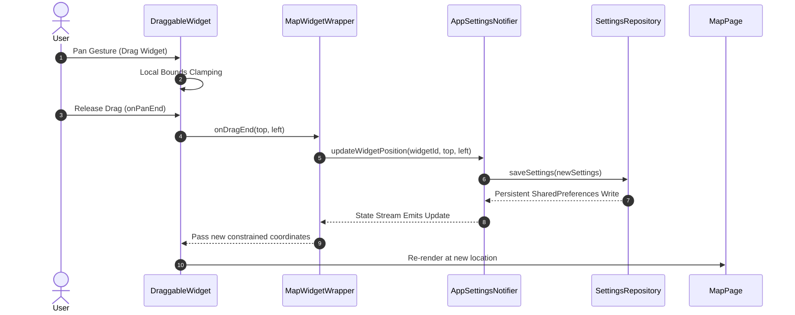
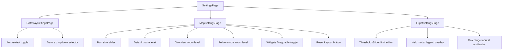

# Customizable Overlay Widgets & Layout Architecture

This document describes the design and implementation of Stork's customizable overlay widget system, the generic draggable layout architecture, and the integrated speed telemetry alerts system with its multi-thumb threshold slider.

---

## 1. Generic Customizable Layout Architecture

To allow pilots and operators to tailor their telemetry dashboards, Stork features a **Customizable Overlay Widget System** implemented on top of the map view. Widgets are positioned as dynamic floaters that can be toggled into an interactive edit mode, dragged around the screen, and saved persistently.



### Component Structure

The architecture is divided into three layers to ensure separation of concerns:

1. **`DraggableWidget` (Presentation/Interaction)**
   - A standalone `StatefulWidget` managing touch gestures and physical viewport constraints.
   - It intercepts pan movements using `GestureDetector` and calculates pixel-based coordinate shifts.
   - Provides a premium visual indicator (moving scale effect, subtle opacity decay, and an edit-mode border with a multi-directional arrow icon) when the edit mode is active.

2. **`MapWidgetWrapper` (State Integration)**
   - A generic glue widget that acts as an adapter. It watches Riverpod's `appSettingsProvider` to determine:
     - Whether edit/move mode is active (`areWidgetsDraggable`).
     - The stored coordinates for its unique `widgetId`.
   - When a drag completes, it calls the `AppSettingsNotifier` to persist the new coordinates.

3. **`AppSettings` & Persistence (Domain/Data)**
   - Coordinates are modeled in `WidgetPosition` (containing double `top` and `left`).
   - The settings state contains `widgetPositions` modeled as a `Map<String, WidgetPosition>`, enabling an infinite number of independent overlay widgets to coexist.
   - The settings are automatically serialized to JSON and persisted locally.

---

## 2. Gesture Handling & Resizing Safety

Dragging elements on dynamic mobile viewports requires robust edge cases handling (e.g., orientation changes, screen resizing, and touch boundaries). Stork handles these issues with three layer-checks:

### Real-Time Local Clamping
During an active drag (`onPanUpdate`), positions are constrained instantly based on the widget's render dimensions and `MediaQuery` boundaries. This prevents the widget from sliding off-screen or disappearing under system status bars:
```dart
if (_left < 0) _left = 0;
if (_top < 0) _top = 0;
if (_left + size.width > screenSize.width) {
  _left = screenSize.width - size.width;
}
if (_top + size.height > screenSize.height) {
  _top = screenSize.height - size.height;
}
```

### Post-Frame Snap Correction
Since rendering sizes might not be fully initialized or may change dynamically, Stork registers a post-frame callback (`WidgetsBinding.instance.addPostFrameCallback`) after constraint updates to snap the widget safely back within the viewport boundaries and trigger a persistence update if boundaries were violated.

### Viewport Metrics Listener
`DraggableWidget` observes `WidgetsBindingObserver` and listens to `didChangeMetrics()`. When a screen rotation or device resizing occurs:
1. Active dragging coordinates are flagged as invalid.
2. Viewport dimensions are queried anew.
3. Coordinates are automatically re-clamped to fit the new viewport limits.
4. If edit mode is disabled, widgets snap back to their stored positions to prevent drifting.

---

## 3. Built-in Implementation: Speed Telemetry & Alert States

The primary built-in implementation of this customizable system is the `SpeedTelemetryWidget`. It combines real-time data ingestion with high-visibility, color-coded threshold alerts and glassmorphic designs.

### Dynamic Connection States
The widget automatically adapts its interface depending on network status (`isConnected` from `cannelloniServiceProvider`) and GPS availability:

| Connection State | Primary Value | Subtitle/Label | Visual Badge |
| :--- | :--- | :--- | :--- |
| **Offline Mode** | Ground Speed (GS) | `"---"` (if missing) | *None* |
| **Connected (Both IAS & GS)** | Indicated Airspeed (IAS) | Ground Speed (GS) in km/h | *None* |
| **Connected (GS only)** | Ground Speed (GS) | GPS Speed | `"GPS ONLY"` (Yellow badge) |
| **Connected (IAS only)** | Indicated Airspeed (IAS) | no GPS signal | `"NO GPS"` (Red badge + satellite icon) |
| **Neither Available** | `"---"` | `"---"` | *None* |

### Alert Evaluation Logic
Avionics parameters need highly visible alerts when crossing critical boundaries. Speed telemetry is evaluated into one of six `ThresholdState` alert regions:

```dart
enum ThresholdState {
  inactive,       // Standby / speed below minimum noise floor
  minError,       // Dangerous stall condition (dangerously slow)
  minWarning,     // Approaching stall boundary
  operational,   // Safe flight envelope
  maxWarning,     // Overspeed caution
  maxError,       // Dangerous structural overspeed limits
}
```

```mermaid
grid-chart
    title Alert State Evaluation Mapping
    [0.0 to inactiveMax] : "inactive"
    [inactiveMax to minError] : "minError"
    [minError to minWarning] : "minWarning"
    [minWarning to maxWarning] : "operational"
    [maxWarning to maxError] : "maxWarning"
    [maxError to maxRange] : "maxError"
```

### Alert Aesthetics & Micro-Animations
To notify pilots without cluttering the screen, state changes animate smoothly (300ms transitions):
- **Glassmorphism**: Built using a nested `BackdropFilter` with `sigmaX: 10, sigmaY: 10` and light/dark variable translucent alphas.
- **Dynamic Shadows & Glows**: Active warnings or errors render intense glowing backlights using soft `BoxShadow` color mixes (e.g., orange glow for warnings, red glow for errors).
- **Constant Borders**: The border changes color between warning stages, but maintains a **constant width (2.0px)**. This prevents layout shifting and screen jittering when moving between thresholds.

---

## 4. Range Thresholds Safety & Boundary Assertions

To guarantee mathematical consistency in safety settings (e.g., warning levels cannot be set higher than error levels), the `RangeThresholds` domain model enforces strict invariants at runtime.

### Boundary Constraints
Instead of relying on compile-time Freezed `@Assert` annotations, `RangeThresholds` validation is performed in the custom factory constructor `RangeThresholds(...)`. If the provided thresholds are out of order, the factory throws an `ArgumentError`.

Specifically, the validation ensures that safety thresholds are logically sorted:
- `minError` <= `minWarning` (minError vs minWarning)
- `maxWarning` <= `maxError` (maxWarning vs maxError)
- `minError` <= `maxError` (minError vs maxError)
- `inactiveMax` <= `minError` (inactiveMax vs minError)

Example validation checks within the factory constructor:
```dart
if (minError != null && minWarning != null && minError > minWarning) {
  throw ArgumentError('minWarning cannot be less than minError');
}
if (inactiveMax != null && minError != null && inactiveMax > minError) {
  throw ArgumentError('inactiveMax cannot be greater than minError');
}
```

For the complete list of validation conditions and exact error messages, please refer directly to the factory implementation in [range_thresholds.dart](file:///home/vjoba/Develop/stork/lib/features/settings/domain/range_thresholds.dart).

### Settings Clamping and Cascading Sanitization
When the maximum slider scale (`flightSpeedMaxRange`) is updated, the `AppSettingsNotifier` performs a cascading clamping routine to sanitize all warning boundaries automatically. This prevents any out-of-bounds assertions from throwing runtime exceptions:

```dart
final newMaxError = (thresholds.maxError ?? 125.0).clamp(0.0, normalizedMaxRange).roundToDouble();
final newMaxWarning = (thresholds.maxWarning ?? 110.0).clamp(0.0, newMaxError).roundToDouble();
final newMinWarning = (thresholds.minWarning ?? 75.0).clamp(0.0, newMaxWarning).roundToDouble();
final newMinError = (thresholds.minError ?? 60.0).clamp(0.0, newMinWarning).roundToDouble();
final newInactiveMax = (thresholds.inactiveMax ?? 10.0).clamp(0.0, newMinError).roundToDouble();
```

---

## 5. ThresholdsSlider & Custom Painting

The boundaries are configured in settings using a custom-engineered **`ThresholdsSlider`** component. Because native Flutter sliders only support single or double-range inputs, Stork utilizes a custom multi-thumb paint widget.

### Touch Interception Logic
The slider receives a `List<double>` representing the 5 thumbs. It determines which thumb is being adjusted by listening to touch inputs inside a `GestureDetector`:
1. **Pan Start (`onPanStart`)**: Translates the touch point `dx` into a fraction of the slider's track width. It compares the touched coordinate against the values of all 5 thumbs and binds active interaction to the closest thumb.
2. **Pan Update (`onPanUpdate`)**: Modifies the value of the active thumb. To ensure sequential integrity, the active thumb's movement is clamped strictly between its direct neighbors:
   ```dart
   final double minVal = _activeThumbIndex! > 0
       ? _currentValues[_activeThumbIndex! - 1]
       : widget.min;
   final double maxVal = _activeThumbIndex! < _currentValues.length - 1
       ? _currentValues[_activeThumbIndex! + 1]
       : widget.max;
   value = value.clamp(minVal, maxVal).roundToDouble();
   ```
3. **Pan End (`onPanEnd`)**: Releases the active thumb selection and updates persistent settings.

### Visual Representation (`_MultiThumbPainter`)
The custom painter renders the track as six separate color blocks representing the safety regions:

- **Segment Track Painting**: Uses standard `Rect` canvases combined with round-corner clips (`RRect.fromRectAndCorners`) at both absolute limits.
- **Overlapping Prevention**: Text labels for the 5 thumbs alternate above and below the slider bar (even index thumbs draw text above the track, odd index thumbs draw text below). This keeps values readable even when thresholds are closely configured.
- **Active Glow Paint**: The active thumb increases in radius (from `10.0px` to `14.0px`) and switches text to bold to provide micro-interaction feedback.

---

## 6. Split Settings Page Navigation

To accommodate the growing configuration settings without cluttering the screen, the settings panel has been reorganized. The central `SettingsPage` now acts as a high-level list routing to three specialized sub-panels:



---

## 7. Performance & Stability Considerations

- **Selective Riverpod Watches**: In `MapWidgetWrapper`, rather than watching the entire `appSettingsProvider` which would rebuild the widget on any change (e.g. font sizes, IP settings), we select only the specific fields required:
  ```dart
  final isDraggable = ref.watch(appSettingsProvider.select((s) => s.value?.areWidgetsDraggable ?? false));
  final position = ref.watch(appSettingsProvider.select((s) => s.value?.widgetPositions[widgetId]));
  ```
- **Clamped Repaint Boundaries**: The custom thresholds painter implements `shouldRepaint` strictly to prevent redundant CPU cycles during general page scrolling:
  ```dart
  @override
  bool shouldRepaint(covariant _MultiThumbPainter oldDelegate) {
    return oldDelegate.values != values ||
        oldDelegate.textColor != textColor ||
        oldDelegate.activeThumbIndex != activeThumbIndex;
  }
  ```
- **Immersive Mode Stability**: While dragging or rendering customizable widgets, `SystemChrome.setEnabledSystemUIMode(SystemUiMode.immersiveSticky)` keeps system task bars hidden, ensuring the interactive drag bounding boxes align perfectly with physical glass dimensions.
