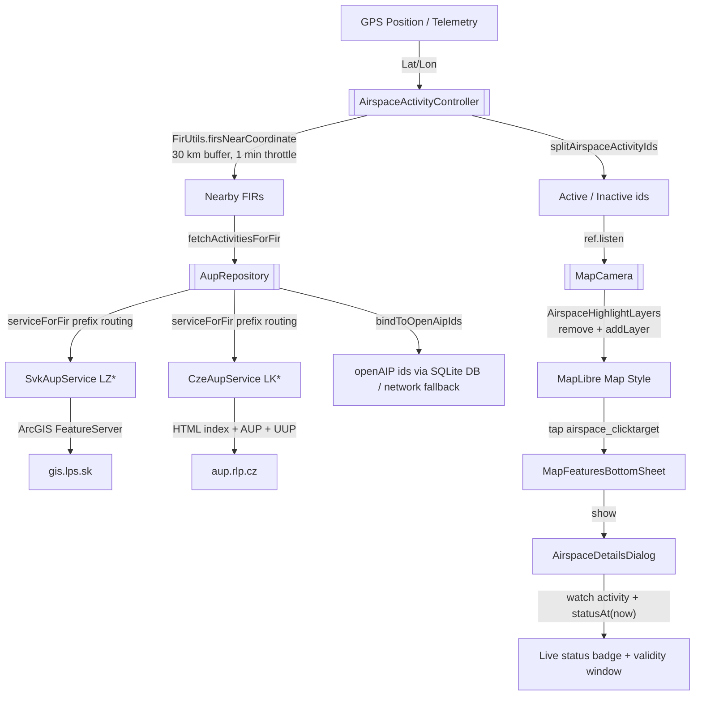

# Active Airspaces (AUP/UUP) Technical Documentation

This document describes the models, AUP/UUP data sources, openAIP id binding, Riverpod state management, map highlighting, and the live status badge in the airspace details dialog for **real-time active airspaces** in the Stork application.

---

## 1. System Overview

Stork continuously evaluates the aircraft position against Flight Information Region (FIR) boundaries and pre-fetches the current **AUP/UUP (Airspace Use Plan / Updated Use Plan)** for every nearby FIR. The parsed activity is bound to existing **openAIP airspace ids** and visualized in two ways:

1.  **Map highlights** — active airspaces are tinted purple, inactive (published/deactivated) airspaces are tinted green directly on the map.
2.  **Details dialog badges** — when an airspace is selected, the details dialog shows a live `Active` / `Inactive` / `Activity Unknown` badge plus the validity time window.



---

## 2. Data Models

All AUP/UUP state is modelled in the [map domain layer](../../lib/features/map/domain/airspace_metadata.dart).

### 2.1. `AirspaceActivityStatus`
Defined in [airspace_activity_status.dart](../../lib/features/map/domain/models/airspace_activity_status.dart):

*   `active` — the airspace is published as activated in the AUP.
*   `inactive` — the airspace is published as not active, or was deactivated by a subsequent UUP.
*   `unknown` — no AUP/UUP information is available.

The static helper `AirspaceActivityStatus.fromPayload(Object? raw)` normalizes raw status tokens from AUP/UUP payloads (`"ACTIVE"`, `"ACTIVATED"`, `"ON"` → `active`; `"INACTIVE"`, `"DEACTIVATED"`, `"NOT ACTIVE"`, `"OFF"` → `inactive`; anything else → `unknown`).

### 2.2. `AupAirspaceActivity`
A single AUP/UUP activity entry parsed from a source:

| Field | Description |
| :--- | :--- |
| `airspaceId` | Bound openAIP airspace identifier (`_id` / `id`) after repository binding; falls back to the AUP designator when no match is found. |
| `designator` | The raw AUP designator (e.g. `LZP23`, `LKTSA2`). |
| `name` | Human-readable name. |
| `status` | Parsed `AirspaceActivityStatus`. |
| `validFrom` / `validTo` | Optional validity window (`DateTime`, UTC). |
| `lowerLimit` / `upperLimit` | Optional `AirspaceLimit` vertical boundaries. |
| `source` | Stable source identifier (`SVK_LZPS`, `CZE_RLP`). |
| `updatedAt` | Time the activity was parsed. |

**Effective status over time** — `AupAirspaceActivity.statusAt(DateTime now)` is the single source of truth for "is this airspace active right now?":

*   An `inactive` / `unknown` status is returned unchanged.
*   An `active` airspace **without** a validity window (e.g. the Slovak LzPS, which only reports current state) stays `active`.
*   An `active` airspace **with** a window is `active` only while $validFrom \le now < validTo$ (inclusive at `validFrom`, **exclusive** at `validTo`), otherwise it reports `inactive`.

### 2.3. Active/Inactive Split
[airspace_activity_utils.dart](../../lib/features/map/domain/utils/airspace_activity_utils.dart) exposes the pure function `splitAirspaceActivityIds(activities, now)`, which partitions an activity map (keyed by openAIP id) into `activeIds` / `inactiveIds` using `statusAt(now)` and discarding unknown/empty-id entries. Being a pure function, the map filtering logic is unit-tested independently of the MapLibre controller.

---

## 3. AUP/UUP Data Sources

The [AupService](../../lib/features/map/domain/services/aup_service.dart) abstraction decouples the repository from any concrete provider:

| Getter | Purpose |
| :--- | :--- |
| `sourceCode` | Stable source identifier (each implementation owns its value — no central registry). |
| `firPrefixes` | ICAO FIR prefixes the service covers (e.g. `['LZ']`, `['LK']`). |
| `countryCode` | ISO 3166-1 alpha-2 country code used to select the openAIP network metadata fallback (e.g. `SK`, `CZ`). |
| `fetchAupData(code)` | Fetches and parses the current activity for a country/FIR code. |

Every service degrades gracefully: on timeout, socket, or parse errors it logs via `debugPrint` and returns `const []`, so the map simply shows no highlights and no badges instead of crashing.

### 3.1. Slovak LzPS — `SvkAupService` (`SVK_LZPS`)
[svk_aup_service.dart](../../lib/features/map/data/services/svk_aup_service.dart) queries the public **ArcGIS FeatureServer** used by the official LzPS airspace reservation viewer (`https://gis.lps.sk/.../Reservation_(Public)2/FeatureServer/0/query`), with CORS support. The `where` clause restricts results to GA/VFR-relevant reservations:

```text
(lower_fl <> 'FL' OR lower_val <= 195) AND
(localtype_txt IS NULL OR localtype_txt <> 'NPZ') AND
(status = 'ACTIVE' OR status = 'APPROVED' OR status = 'ALLOCATED'
 OR status = 'REFERENCE_ALLOCATED' OR status = 'PENDING')
```

Because the server only returns the designator (`outFields=airspace`) and the `where` clause already filters by status, `parseLzpsGisResponse` marks **every** returned feature `active` with **no** validity window. On Web, the request is routed through the CORS web proxy (`ApiConstants.webProxyNotamSearchUrl`).

### 3.2. Czech ŘLP (AMC ČR) — `CzeAupService` (`CZE_RLP`)
[cze_aup_service.dart](../../lib/features/map/data/services/cze_aup_service.dart) parses the official Czech AUP portal [`https://aup.rlp.cz/`](https://aup.rlp.cz/), which publishes dated HTML documents:

1.  Fetch the **index page** and parse it with `parseAupIndex` — the first `aup_<DDMMYYYY>.htm` (valid AUP) plus all `uup_<DDMMYYYY>_<HHMM>_<rand>.htm` updates.
2.  Fetch the AUP document and parse the section C table ("Prostory spravovane AMC") with `parseAupDocument` — one row per AMC-managed airspace activation.
3.  Fetch every UUP and **merge** the updates over the base AUP: rows whose last column contains `CNL` cancel the activation (become `inactive`), every other UUP row updates the activation in place.

Key details:

*   **Limits** use Czech formats — `F095` (= FL95, *not* `FL95`), `5000FT/AMSL`, `1000FT/AGL`, `GND` — parsed by the shared `parseAupLimit` in [aup_parsing.dart](../../lib/features/map/data/utils/aup_parsing.dart) (which also handles `FL95`, `9500FT`, `2500M`, `UNL`).
*   **Times** are UTC `HH:MM` within the AUP day (`OD ... 06:00 DO ... 06:00`); UUP rows resolve against the **AUP validity window** (passed as `dayWindow`), not the UUP's own issue-time validity.
*   **Designator normalization** — the portal publishes `TSA2` while openAIP names the same airspace `LKTSA2`; `CzeAupService` prepends the `LK` prefix (`_openAipDesignatorPrefix`) to every parsed designator so the shared repository binding stays country-agnostic.
*   **Encoding** — documents are windows-1250 (ASCII in practice), decoded with `latin1.decode(bodyBytes)` (the index is UTF-8, but only HREFs are parsed).
*   **CORS** — `aup.rlp.cz` sends no CORS headers, so Web builds go through the same web proxy as NOTAMs.

---

## 4. Repository Binding to openAIP Ids

[AupRepository](../../lib/features/map/data/repositories/aup_repository.dart) aggregates the registered services and binds parsed activity entries to existing **openAIP airspace ids**:

*   **Service routing** — `serviceForFir(firIcao)` returns the first service whose `firPrefixes` match the FIR ICAO code (e.g. `LZBB` → `SvkAupService`, `LKAA` → `CzeAupService`); `null` when no service covers the FIR (no fallback, activities stay empty).
*   **`fetchActivitiesForFir(firIcao)`** — routes to the service, then calls `bindToOpenAipIds`.
*   **`bindToOpenAipIds(activities, firIcao)`** — matches each AUP designator against openAIP features in priority order:
    1.  **Exact id** — openAIP feature `_id` / `id` equals the designator.
    2.  **Normalized name** — openAIP name equal to the designator ignoring whitespace/case (e.g. designator `R33` ↔ name `R 33`).
    3.  **Name token** — openAIP airspace names are `designator + ' ' + name` (e.g. `LZP23 SALA`), so the token index matches designator `LZP23`.
    4.  **Network fallback** — when the airspace is missing from the offline database, the openAIP network metadata of the service's `countryCode` (`sk_asp.geojson` / `cz_asp.geojson`) is downloaded once per country per session and indexed the same way.
*   **Caching** — the openAIP `asp` features are scanned from the SQLite `openaip_features` table once per session (`_aspFeaturesCache`), so binding does not re-query the database on every FIR evaluation. The network fallback index (`_networkIdIndexByCountry`) is intentionally in-memory per session.
*   When no match is found the entry keeps its designator as `airspaceId` so it can still be looked up by designator.

The provider (registered in `lib/main.dart` at startup and kept alive) constructs the repository with both country services and disposes the shared `http.Client` on teardown:

```dart
@Riverpod(keepAlive: true)
AupRepository aupRepository(Ref ref) {
  final client = http.Client();
  ref.onDispose(() => client.close());
  final metadataRepository = ref.watch(mapMetadataRepositoryProvider);
  return AupRepository([
    SvkAupService(client: client),
    CzeAupService(client: client),
  ], metadataRepository);
}
```

---

## 5. State Management (Riverpod)

[airspace_activity_provider.dart](../../lib/features/map/presentation/providers/airspace_activity_provider.dart) hosts the `AirspaceActivityController` notifier (kept alive, generated provider name `airspaceActivityProvider` — the `*Controller` suffix avoids colliding with the `AirspaceActivity` enum in the domain layer).

### 5.1. Position-Driven Pre-fetch
*   The notifier subscribes to the telemetry aircraft position (`telemetryProvider.select(...)` on latitude/longitude) and evaluates it at most **once per minute** (`kAirspaceEvaluationInterval`, throttled with `clock.now()` for testability).
*   On each evaluation it finds every FIR within a **30 km buffer** (`kAirspacePrefetchBufferMeters`) of the aircraft via `FirUtils.firsNearCoordinate` and immediately fetches AUP data for each nearby FIR (no additional fetch cooldown).
*   The first evaluation runs immediately on build if a valid GPS fix exists — the `null`/`0,0` early-return does **not** record an evaluation time, so the very first valid fix triggers a fetch at once.

### 5.2. Pruning & Consistency
*   `_pruneStaleActivities` removes activities contributed by FIRs the aircraft has left, so the map stops highlighting airspaces that are no longer nearby and the provider state does not grow unbounded.
*   Re-fetching a FIR **replaces** its previous entries (`_activitiesByFir` tracks per-FIR ids), so airspaces deactivated by a UUP disappear from the state.
*   A `_inflightFirs` set guards against duplicate concurrent fetches for the same FIR.
*   The exposed state is always an **unmodifiable snapshot** (`Map.unmodifiable(Map.of(...))`), never the internal mutable map.
*   `lib/main.dart` warms up `airspaceActivityProvider` at startup so the pre-fetcher starts monitoring immediately.

---

## 6. Map Rendering

### 6.1. Style Layers (`assets/openaip/styles.json`)
Four highlight layers are defined on the existing `openaip-data` / `airspaces` source (no geometry is duplicated) with empty `["literal", []]` filters, positioned right before the style's built-in `highlighted-airspaces` layers:

| Layer id | Type | Paint |
| :--- | :--- | :--- |
| `active-airspaces-fill` | fill | `#9C27B0`, opacity `0.35` |
| `active-airspaces-line` | line | `#FF1744`, width `3.0` |
| `inactive-airspaces-fill` | fill | `#4CAF50`, opacity `0.15` |
| `inactive-airspaces-line` | line | `#2E7D32`, width `1.5` |

The transparent hit-test layer `airspace_clicktarget` sits just above them so the map tap interaction is not blocked.

### 6.2. Runtime Filter Application
[airspace_highlight_layers.dart](../../lib/features/map/presentation/providers/airspace_highlight_layers.dart) — `AirspaceHighlightLayers`:

*   Because the MapLibre API exposes **no `setFilter`** method, layers are **removed and re-added** with the current `source_id` filter built by `airspaceSourceIdFilter(ids)`:
    ```text
    ['all', ['in', ['get', 'source_id'], ['literal', ids]]]
    ```
*   The paint for each layer is read back from the cached `assets/openaip/styles.json` asset (`layerPaint`), keeping **styles.json as the single source of truth** for colours — there are no hard-coded AUP colours in Dart. Layers missing from the style fall back to MapLibre defaults (`const {}`).
*   Layers are re-added `belowLayerId: 'airspace_clicktarget'` when the style defines it (checked via `styleHasLayer`), otherwise appended at the end of the layer stack.
*   `updateLayers` first calls `removeAll`, and when both id lists are empty it leaves the layers removed so no stale highlight remains.

### 6.3. Synchronization with the Map Camera
[map_camera_airspace.dart](../../lib/features/map/presentation/providers/map_camera_airspace.dart) (`MapCameraAirspace.updateAirspacesOnMap`) runs when the map controller is ready and:

1.  Reads the current activity map and splits it with `splitAirspaceActivityIds(activities, clock.now())`.
2.  Diffs against the previously applied id lists (`_lastActiveAirspaceIds` / `_lastInactiveAirspaceIds` with `listEquals`) — the layers are only re-applied when the active/inactive sets actually changed.
3.  Delegates the style mutation to `AirspaceHighlightLayers`, wrapping it in try/catch + `debugPrint` (the call is fire-and-forget via `unawaited`).

`map_camera_provider.dart` wires this up by listening to `airspaceActivityProvider`:

```dart
ref.listen(airspaceActivityProvider, (previous, next) {
  unawaited(updateAirspacesOnMap());
});
```

---

## 7. UI Components

### 7.1. Airspace Details Dialog
[airspace_details_dialog.dart](../../lib/features/map/presentation/components/dialogs/airspace_details_dialog.dart) renders one or more airspaces tapped at the same location inside the standard `BaseDetailsDialog` (frosted glass, draggable). Each entry is an `AirspaceDetailCard` (a `ConsumerStatefulWidget`):

*   Watches `airspaceMetadataProvider(airspaceId, countryCode)` for the static metadata **and** `airspaceActivityProvider.select(...)` for the real-time activity of that airspace id.
*   Merges the activity into the metadata via `AirspaceMetadata.copyWith(activityStatus: ..., activityValidFrom: ..., activityValidTo: ...)` so the effective status and window are shown.
*   Displays a **live status badge**:

| Status | Badge |
| :--- | :--- |
| `active` | purple (`#E040FB`) bolt icon, "Active" |
| `inactive` | green (`#66BB6A`) block icon, "Inactive" |
| `unknown` | grey help icon, "Activity Unknown" |

*   Also shows the activity **source** and, when a window exists, the `Validity` row formatted as `HH:mm UTC – HH:mm UTC`.
*   A **30-second periodic timer** (`_refreshInterval`) re-evaluates `statusAt(clock.now())` while the dialog is open, so a status change at a validity boundary is reflected without waiting for a new fetch; the timer is cancelled in `dispose`.

All user-visible strings use localized keys (`airspaceActivityStatusActive`, `airspaceActivityStatusInactive`, `airspaceActivityStatusUnknown`, `airspaceActivityTimeWindow`, `airspacesAtLocation`, ...) from `lib/l10n/app_en.arb` / `app_sk.arb`.

---

## 8. Verification & Tests

The active airspace engine is verified by the following automated test suites:

| Target Component | Test File | Scope |
| :--- | :--- | :--- |
| **AUP Services (SVK/CZE)** | [aup_service_test.dart](../../test/features/map/domain/services/aup_service_test.dart) | `AirspaceActivityStatus.fromPayload` token parsing, LzPS ArcGIS response parsing, ŘLP index/AUP/UUP parsing including `CNL` cancellations and Czech `F###` limits. |
| **Repository Binding** | [aup_repository_test.dart](../../test/features/map/data/repositories/aup_repository_test.dart) | FIR routing by prefix, openAIP id binding (exact / name / token / network fallback). |
| **Time Validity & Split** | [airspace_activity_utils_test.dart](../../test/features/map/domain/utils/airspace_activity_utils_test.dart) | `statusAt` window boundaries (inclusive start, exclusive end) and `splitAirspaceActivityIds` behaviour. |
| **Riverpod Pre-fetch** | [airspace_activity_provider_test.dart](../../test/features/map/presentation/providers/airspace_activity_provider_test.dart) | 30 km FIR buffer pre-fetch, 1-minute evaluation throttle, per-FIR pruning/replacement, in-flight deduplication. |
| **Map Highlight Layers** | [airspace_highlight_layers_test.dart](../../test/features/map/presentation/providers/airspace_highlight_layers_test.dart) | Layer add/remove with a fake `StyleController`, filter building, `belowLayerId` fallback, plus a real-asset smoke test verifying `styles.json` still defines the four layers and `airspace_clicktarget`. |
| **Details Dialog UI** | [airspace_details_dialog_test.dart](../../test/features/map/presentation/components/airspace_details_dialog_test.dart) | Renders Active/Inactive/Unknown badges (including the Slovak locale) and time-window assertions using `withClock(Clock.fixed(...))`. |

---

## 9. Notes & Limitations

*   Only **Slovak (LZ\*)** and **Czech (LK\*)** FIRs currently have AUP/UUP sources; other countries return no activities (and thus no highlights or badges). Adding a country means adding a service registered in the `aupRepository` provider list — the prefix/country/source knowledge lives with each service (open/closed).
*   The Slovak LzPS source reports only the current state (no validity window), so `statusAt` keeps such entries `active` for as long as they are in the state.
*   The Czech portal publishes no CORS headers, so the Web build routes AUP requests through the existing CORS web proxy.
*   The openAIP network fallback downloads the whole country metadata file once per country per app session and is never persisted — the offline database remains the primary binding source.
