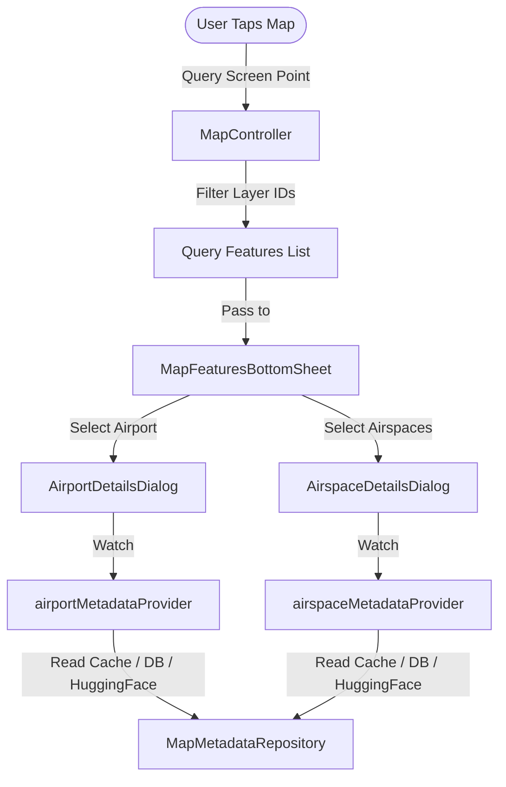
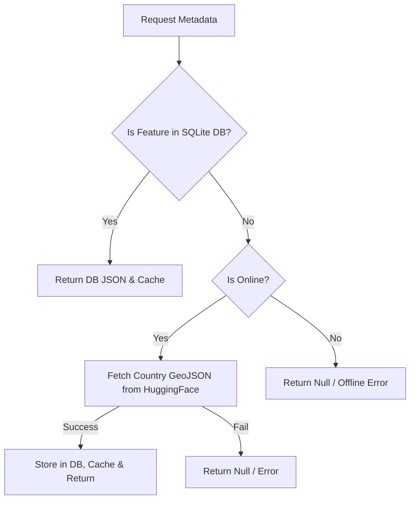

# Aeronautical Metadata & Map Interaction

This document describes the models, storage, network synchronization, and map click-interaction system for **OpenAIP Aeronautical Metadata** (Airports, Airspaces, and Places) in the Stork application.

---

## 1. System Overview

Stork features an interactive, offline-first Aeronautical Metadata system. When navigating the map, pilots can:
1. Tap on airports, runways, airspaces, or localities to query details.
2. View detailed airport properties, including active radio frequencies, runway dimensions/compositions, and real-world aerial imagery.
3. Inspect airspace classifications, vertical boundaries (lower/upper limits), and activity states (e.g., skydiving, NOTAM flags).
4. Auto-tune radio frequencies (logged in the debugging console).

---

## 2. Aeronautical Data Models

Aeronautical data is modeled into strongly typed Dart objects matching the OpenAIP GeoJSON schema:

### 2.1. Airport Metadata

An airport is modeled via the [AirportMetadata](../../lib/features/map/domain/models/airport_metadata.dart) class.

*   **Core Fields**:
    *   `id`: Unique OpenAIP string identifier.
    *   `name`: Display name.
    *   `icaoCode`: 4-character ICAO code.
    *   `type`: Type of airport represented by the `AirportType` enum (e.g. `civilAirport`, `gliderSite`, `heliport`).
    *   `elevation`: Altitude of the airport modeled in `AirportElevation` containing value and unit.
    *   `latitude` & `longitude`: Geolocation coordinates.
*   **Aeronautical Infrastructure**:
    *   **Frequencies**: A list of `AirportFrequency` items. Each contains the frequency value, unit (e.g. `MHz`), classification `FrequencyType` (e.g. `tower`, `approach`, `atis`), and a `primary` flag.
    *   **Runways**: A list of `AirportRunway` items. Each contains the runway designator (e.g. `09/27`), dimensions (length and width in `RunwayDimension`), surface classification (`RunwaySurface`), and a `mainRunway` flag.
    *   **Images**: A list of `AirportImage` items representing user-uploaded airport diagrams or runway photographs.

### 2.2. Airspace Metadata

An airspace is modeled via the [AirspaceMetadata](../../lib/features/map/domain/models/airspace_metadata.dart) class.

*   **Core Fields**:
    *   `id`: Unique identifier.
    *   `name`: Name (e.g. "MTR Bratislava").
    *   `icaoClass`: Airspace classification letter mapped by the `AirspaceClass` enum (`a`, `b`, `c`, `d`, `e`, `f`, `g`).
    *   `type`: Airspace purpose represented by `AirspaceType` (e.g. `ctr`, `d`, `r`, `tmz`, `wip`).
*   **Vertical Limits**:
    *   `limitLower` & `limitUpper`: Defined in `AirspaceLimit` containing `value`, `unit` (e.g. `FL`, `FT`, `M`), and `referenceDatum` (e.g. `MSL`, `GND`, `STD`).
*   **Operational Flags**:
    *   `activity`: Current activity level represented by `AirspaceActivity` (e.g. `skydive`, `glider`, `none`).
    *   `byNotam`: Activated by NOTAM warnings.
    *   `onRequest`: Activation on request.
    *   `onDemand`: Activated on demand.

---

## 3. Data Synchronization & Storage

To keep data responsive and offline-capable, Stork employs a two-stage metadata acquisition and caching mechanism:

### 3.1. Country Bounding Box Detection

During the offline map download sequence in `OfflineMapsNotifier`:
1.  **Zoom Scanning**: The engine retrieves downloaded vector `openaip` map tiles at zoom level 10 (or zoom level 7 for very large regions to prevent memory bloating).
2.  **Tile Parsing**: It parses the vector geometries using the `vector_tile` package.
3.  **Country Extraction**: It extracts the unique values of the `country` key from the features in these tiles (e.g., `SK`, `AT`).
4.  **Metadata Queue**: The list of discovered countries determines which metadata files will be fetched.

### 3.2. Hybrid Storage (Offline DB vs Online Fetch)

Metadata retrieval is resolved reactively via Riverpod providers ([airportMetadataProvider](../../lib/features/map/presentation/providers/airport_metadata_provider.dart) and [airspaceMetadataProvider](../../lib/features/map/presentation/providers/airspace_metadata_provider.dart)):

1.  **Local Database Look-up**: The repository queries the local SQLite database (`DatabaseService.getOpenAipFeature`) using the feature's `id`. If found, the JSON string is decoded and returned immediately.
2.  **Remote Fallback**: If the feature is missing from the database (e.g., when browsing the map online without downloading the offline region first), the repository fetches the supplemental country-specific GeoJSON files from the HuggingFace OpenAIP dataset:
    *   Airports: `${OpenAipMetadataBaseUrl}/${countryCode}_apt.geojson`
    *   Airspaces: `${OpenAipMetadataBaseUrl}/${countryCode}_asp.geojson`
3.  **Database Ingestion**: The downloaded country GeoJSON dataset is parsed inside a background isolate (`compute`) and all features are written to the SQLite database via `DatabaseService.insertOpenAipFeatures`. This ensures that subsequent lookups for any feature in that country occur entirely offline.
4.  **Caching**: To prevent repeatedly reading from SQLite or decoding JSON strings, both airport and airspace providers utilize Riverpod's automatic caching. Toggling offline maps clearing or triggering a fresh map download calls `clearCache()` to release memory.

---

## 4. Map Click & Interaction System

Map selection utilizes MapLibre’s native screen-coordinate feature queries:

### 4.1. Click Target Layers

When the user taps the map, the event is routed to [MapCamera.handleMapEvent](../../lib/features/map/presentation/providers/map_camera_provider.dart). The handler calls `featuresAtPoint` against the following MapLibre layers:

*   **Airports**:
    *   `airport_clicktarget`, `airport_runway`, `airport_parachute`, `airport_gliding`, `airport_gliding_winch`, `airport_other`, `airport_with_code_runway`, `airport_with_code`, `airport_runway_intl`, `airport_intl`
*   **Airspaces**:
    *   `airspace_clicktarget`
*   **Localities / Places**:
    *   `places_locality`

### 4.2. Bottom Sheet Dispatcher ([MapFeaturesBottomSheet](../../lib/features/map/presentation/components/controls/map_features_bottom_sheet.dart))

If any features are detected at the tap coordinates, a custom translucent bottom sheet is shown:
*   Features are grouped and presented as list items.
*   Airports are displayed with their identifier and runway icon.
*   Airspaces show their name and active class badge.
*   Tapping an item opens the respective full details dialog.

### 4.3. Airport Details Dialog ([AirportDetailsDialog](../../lib/features/map/presentation/components/dialogs/airport_details_dialog.dart))

A comprehensive details screen displaying:
*   **Monospace Typography**: Clean layout showing airport elevation and magnetic declination.
*   **Warning Badges**: Dynamic chips indicating `PPR` (Prior Permission Required), `Private` airfield status, `Skydiving` activities, or `Winch Only` gliding sites.
*   **Interactive Frequencies**: Lists all frequencies. Tapping a frequency triggers a tune request callback (`debugPrint('Setting radio frequency: ...')`). Primary frequencies are highlighted in blue.
*   **Runways Table**: Displays runway designators, dimensions, and composite surfaces. Main runways are highlighted with an amber star badge.
*   **Image Gallery**: Integrates a `PhotoViewGallery` widget allowing swipe gestures and double-tap zoom to inspect airport diagrams.

### 4.4. Airspace Details Dialog ([AirspaceDetailsDialog](../../lib/features/map/presentation/components/dialogs/airspace_details_dialog.dart))

A multi-airspace listing card featuring:
*   **Descending Sort**: Automatically groups and sorts airspaces by their vertical upper limit (highest altitude first).
*   **Limit Range Indicators**: Renders lower limits in orange (floor) and upper limits in blue (ceiling), translating flight levels and height values into standard symbols (e.g. `FL 120` or `2000 ft MSL`).
*   **Operational Badges**: Renders colored labels for active flags such as `byNotam`, `onRequest`, or `onDemand`.
*   **OpenAIP Link-out**: Provides an external redirect button targeting the official OpenAIP data portal: `https://www.openaip.net/data/airspaces/${id}`.
*   **Real-time AUP/UUP Status Badge**: When live activity has been pre-fetched for the airspace, the card also shows a `Active` / `Inactive` / `Activity Unknown` badge with its validity window. See [Active Airspaces (AUP/UUP)](active-airspaces.md) for the full pipeline.

---

## 5. Verification & Tests

Aeronautical metadata features are tested under the following suites:

| Test Target | File Path | Scope |
| :--- | :--- | :--- |
| **Airport Domain** | [airport_metadata_test.dart](../../test/features/map/domain/airport_metadata_test.dart) | Parses airport JSON structure, checks unit symbols, and tests runway compositions. |
| **Airspace Domain** | [airspace_metadata_test.dart](../../test/features/map/domain/airspace_metadata_test.dart) | Verifies vertical limit logic, unit formatting, and airspace class enum values. |
| **Enums & Localizations** | [openaip_enums_test.dart](../../test/features/map/presentation/utils/openaip_enums_test.dart) | Asserts correct localized string conversions for airport and airspace classifications. |
| **Details Dialogs** | [airport_details_dialog_test.dart](../../test/features/map/presentation/components/dialogs/airport_details_dialog_test.dart) | Simulates mock metadata loading and asserts proper warning chip rendering. |
| **Bottom Sheet** | [map_features_bottom_sheet_test.dart](../../test/features/map/presentation/components/controls/map_features_bottom_sheet_test.dart) | Validates that tap features are parsed and listed correctly. |
