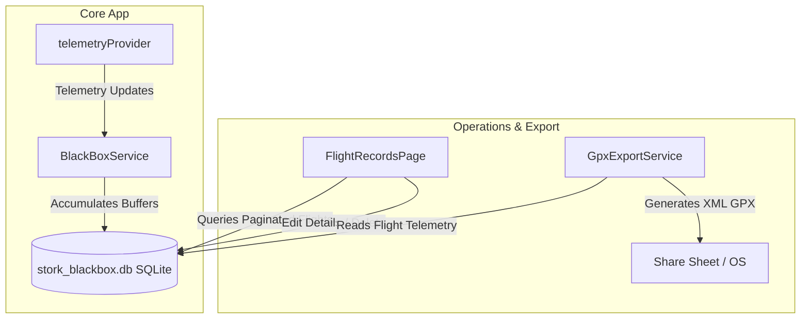
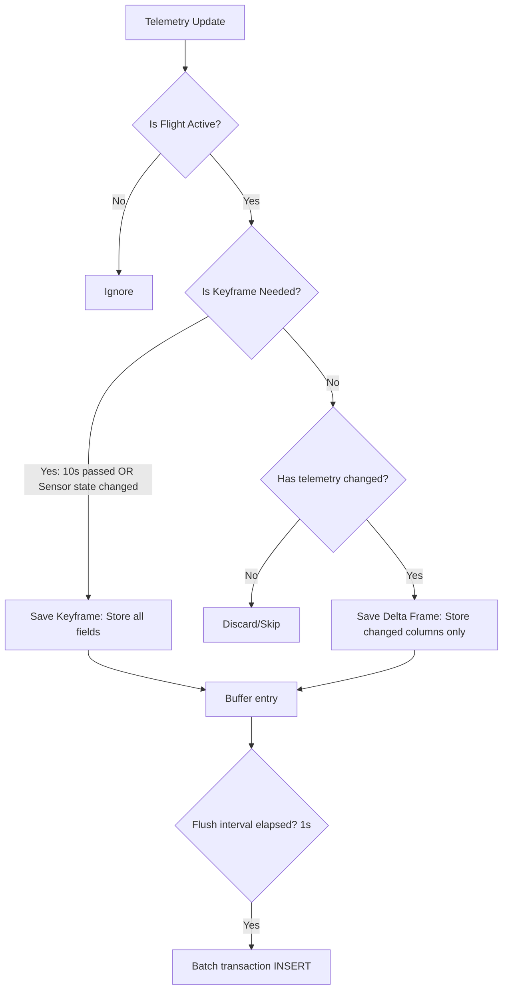

# Black Box Flight Logging & Telemetry Database Architecture

This document describes the design, database schema, performance optimizations, compression algorithms, and crash-recovery procedures of Stork's automated **Black Box** flight logging and GPX export system.

---

## 1. System Overview

Stork integrates an automated flight recording system ("Black Box") that runs continuously in the background while the application is active. The system monitors live flight telemetry to detect when the aircraft takes off and lands, automatically recording high-density telemetry packets into a local SQLite database without requiring any user interaction.



---

## 2. Platform-Specific Database Implementations

To maintain database isolation and optimal read/write concurrency, the Black Box records are stored in a dedicated database file (`stork_blackbox.db`). The layer is defined by the abstract interface [BlackBoxDatabase](../../lib/core/services/database/black_box_database.dart) and conditional imports:

- **IO Platforms (Android, iOS, Desktop)**: Implemented in [IoBlackBoxDatabase](../../lib/core/services/database/black_box_database_io.dart) using the native `sqlite3` driver bindings. The database file is placed in:
  - On Android: SD card storage if a physical removable SD card is present, otherwise falls back to the primary external storage directory (unprotected/accessible shared storage).
  - On iOS/Desktop: `ApplicationDocumentsDirectory` (system documents folder).
  
  **SQLite Performance Configurations:**
  - `PRAGMA foreign_keys = ON;` (Ensures cascade deletion of telemetry and statistics).
  - `PRAGMA journal_mode = WAL;` (Write-Ahead Logging to support concurrent reads while writing).
  - `PRAGMA synchronous = FULL;` (Ensures that committed transactions are physically written/sync'd to disk immediately, preventing telemetry loss in a crash).
  - `PRAGMA busy_timeout = 5000;` (Avoids database lock failures under quick continuous transactions).
  
- **Web Platform**: Implemented in [WebBlackBoxDatabase](../../lib/core/services/database/black_box_database_web.dart) as a set of stubs/no-op functions, returning empty collections. Flight records are disabled on the web.

---

## 3. Schema Design and Schema Evolution

The SQLite database consists of three primary tables configured on initialization:

```sql
CREATE TABLE IF NOT EXISTS flights (
    uuid TEXT PRIMARY KEY,
    name TEXT NOT NULL,
    start_time TEXT NOT NULL,
    end_time TEXT,
    pilot_id TEXT,
    airplane_id TEXT
);

CREATE TABLE IF NOT EXISTS flight_telemetry (
    id INTEGER PRIMARY KEY AUTOINCREMENT,
    flight_uuid TEXT NOT NULL,
    timestamp TEXT NOT NULL,
    is_snapshot INTEGER NOT NULL DEFAULT 0,
    -- Dynamic fields mapped from TelemetryField e.g.:
    latitude REAL,
    longitude REAL,
    heading REAL,
    ground_speed REAL,
    indicated_air_speed REAL,
    engine_rpm REAL,
    air_pressure REAL,
    gps_altitude REAL,
    gps_satellite_count INTEGER,
    gps_horizontal_accuracy REAL,
    gps_vertical_accuracy REAL,
    is_gps_drone_can INTEGER,
    FOREIGN KEY (flight_uuid) REFERENCES flights(uuid) ON DELETE CASCADE
);

CREATE TABLE IF NOT EXISTS flight_statistics (
    flight_uuid TEXT PRIMARY KEY,
    max_altitude REAL,
    total_ascent REAL,
    total_descent REAL,
    avg_altitude REAL,
    max_ground_speed REAL,
    max_indicated_air_speed REAL,
    avg_ground_speed REAL,
    avg_indicated_air_speed REAL,
    total_distance REAL,
    max_distance_from_takeoff REAL,
    avg_engine_rpm REAL,
    FOREIGN KEY (flight_uuid) REFERENCES flights(uuid) ON DELETE CASCADE
);
```

### 3.1. Dynamic Schema Evolution
To adapt the database schema to future additions of telemetry fields without requiring manual migrations, Stork maps the database columns dynamically from the [TelemetryField](../../lib/features/telemetry/domain/models/telemetry_state.dart) enum. On database initialization, `_migrateSchema` queries `PRAGMA table_info(flight_telemetry)` to verify existing columns, executing `ALTER TABLE flight_telemetry ADD COLUMN` commands for any newly added telemetry fields.

### 3.2. Indexing Optimizations
To support rapid paging of logs and efficient retrieval, three compound indices are created:
- `idx_flights_start_time` on `flights (start_time DESC)` (Accelerates paging of the flight history).
- `idx_telemetry_flight_id` on `flight_telemetry (flight_uuid, id)` (Accelerates telemetry queries and sequential exports).
- `idx_telemetry_timestamp` on `flight_telemetry (timestamp)` (Used for temporal operations).

---

## 4. Telemetry Recording & Delta Compression

A naive recording system that logs every state update generates massive quantities of redundant files. To prevent excessive disk space utilization and database fragmentation, Stork implements a **Delta Compression** model in the [BlackBoxService](../../lib/features/telemetry/presentation/providers/black_box_provider.dart) Riverpod provider:



### 4.1. Keyframes vs. Delta Frames
The telemetry data is stored as a series of frames:
- **Keyframe (Snapshot)**: Emitted when a flight starts, every **10 seconds**, or when a sensor connection status changes (e.g. coordinates changing from `null` to a valid coordinate). Keyframes store the full state of all non-null telemetry fields (`is_snapshot = 1`).
- **Delta Frame**: Emitted when the telemetry state changes. Only fields whose values have *mutated* since the last buffered state are written to the database column; unchanged fields are inserted as `NULL` (`is_snapshot = 0`). This significantly reduces database size during stable, steady flights.

### 4.2. Buffering, Batch Flush & Background Offloading
To prevent data loss and keep the UI thread responsive:
- Telemetry entries are accumulated in a memory list (`_buffer`).
- A periodic timer ticks every **1 second**, flushing the memory buffer.
- To guarantee crash safety without blocking the main UI thread (due to the synchronous disk sync forced by `PRAGMA synchronous = FULL`), the flush operation (`insertTelemetryEntries`) is offloaded to a background Dart Isolate via `Isolate.run`. In unit tests, a synchronous fallback is used to stay compatible with `fakeAsync`.

---

## 5. Background Statistics Computation

Calculating flight statistics (e.g., total distance, ascent, averages) over millions of recorded telemetry rows can block the Dart main thread and cause UI stuttering. Stork offloads this work to a separate execution thread (Isolate) immediately after a flight ends.

### 5.1. Isolate Processing
When a flight ends, [BlackBoxService](../../lib/features/telemetry/presentation/providers/black_box_provider.dart) invokes:
```dart
await Isolate.run(() => _calculateAndSaveStatsIsolate(dbPath, flightUuid));
```
This spawns a background thread, opens a separate handle to the database, reads telemetry entries in pages of **5000 rows**, feeds them sequentially into a [FlightStatisticsCalculator](../../lib/features/telemetry/domain/utils/flight_statistics_calculator.dart), and saves the final result to the `flight_statistics` table.

### 5.2. Statistics Calculation Logic
The [FlightStatisticsCalculator](../../lib/features/telemetry/domain/utils/flight_statistics_calculator.dart) calculates:
- **Maximums**: Scans altitude, ground speed, and indicated air speed for peak values.
- **Averages (Time-Weighted)**: To ensure statistical accuracy, averages are weighted by the time interval ($\Delta t$) between consecutive records to account for varying telemetry update frequencies:
  $$\text{Average} = \frac{\sum (x_i \cdot \Delta t_i)}{\sum \Delta t_i}$$
- **Ascent / Descent**: Tracks accumulated gains and losses by comparing sequential GPS altitudes.
- **Distance Accumulation**: Accumulates the geographic distance flown by measuring the Haversine distance between sequential coordinate points.
- **Max Distance from Takeoff**: Measures the maximum straight-line Haversine distance between the first coordinate (takeoff position) and any subsequent point.

---

## 6. Crash Recovery (Unfinished Flights)

If the mobile device loses power, the application crashes, or the OS force-closes the background process during a flight, the database will contain a flight record with a `NULL` end time.

To resolve this, Stork executes a recovery process on startup:
1. During `BlackBoxService` initialization, it queries all flights in the database where `end_time` is `NULL` via `recoverUnfinishedFlights()`.
2. For each unfinished flight, it fetches the timestamp of the last recorded telemetry entry.
3. It updates the flight's `end_time` to this last timestamp (or the start time if no telemetry was logged).
4. It computes and saves the flight's statistics on a background isolate, successfully closing the flight and protecting the integrity of the flight log database.

---

## 7. User Interface and GPX Export

### 7.1. Paginated Flight History
The [FlightRecordsPage](../../lib/features/telemetry/presentation/pages/flight_records_page.dart) retrieves flights from the repository using the [FlightRecords](../../lib/features/telemetry/presentation/providers/flight_records_provider.dart) Riverpod provider.
- It displays a paginated list with a page size of **20 flights**.
- More flights are lazily fetched when the user scrolls near the bottom of the list.
- Tapping on a flight card expands it to reveal the flight statistics widget, which displays all data scaled according to the user's unit settings (metric vs. imperial).
- Offers editing flight details (name, pilot ID, aircraft ID) via [EditFlightDialog](../../lib/features/telemetry/presentation/dialogs/edit_flight_dialog.dart), or deleting flights (triggers a cascade delete of all corresponding statistics and telemetry rows).

### 7.2. GPX Track Generation & Export
Users can export their flight path as a GPX track via [GpxExportService](../../lib/core/services/export/gpx_export_service.dart).
- It queries the GPX-compatible telemetry database records (only timestamp, latitude, longitude, and MSL altitude to save memory).
- It outputs a standardized XML GPX v1.1 format containing the track and segment nodes:
  ```xml
  <gpx version="1.1" creator="Stork" ...>
    <metadata>
      <name>Flight Name</name>
      <time>2026-06-25T13:54:33Z</time>
    </metadata>
    <trk>
      <name>Flight Name</name>
      <trkseg>
        <trkpt lat="48.148" lon="17.107"><ele>150.0</ele><time>2026-06-25T13:54:34Z</time></trkpt>
      </trkseg>
    </trk>
  </gpx>
  ```
- **Throttling**: To maintain a compact GPX file size, track points are throttled to a maximum frequency of **1Hz** (points are ignored if they occur less than 1 second after the last written point).
- The file is saved to the local system cache directory and shared via the system share sheet using the `share_plus` library.
