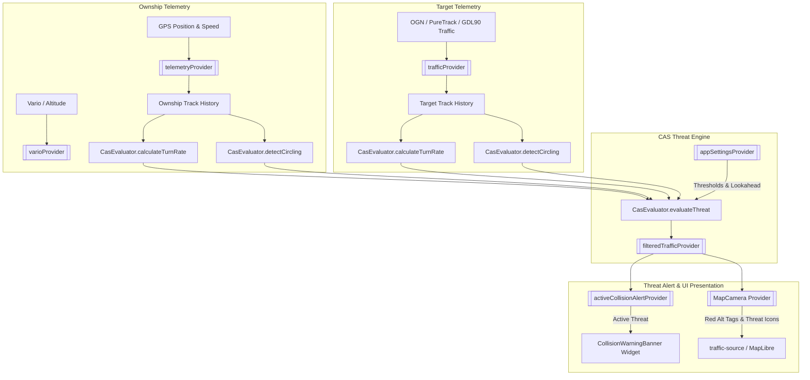
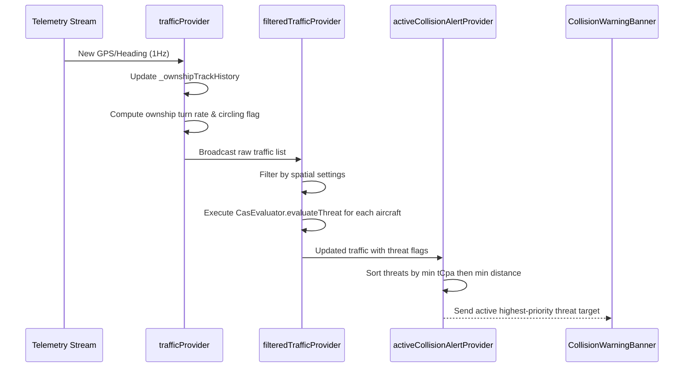

# Collision Avoidance System (CAS) Technical Documentation

This document describes the design, mathematical model, 3D threat volume evaluation, thermal co-circling suppression logic, Riverpod state integration, map rendering, and user interface components for the **Collision Avoidance System (CAS)** in the Stork application.

---

## 1. System Overview

The Collision Avoidance System (CAS) continuously monitors surrounding traffic received from all telemetry sources — the Open Glider Network (OGN) APRS network, PureTrack SSE/WebSocket, and local GDL90 UDP receivers — and compares target trajectories against the pilot's ownship telemetry. When a target's projected 3D trajectory breaches the configured safety volume within a short lookahead time horizon, the system flags the target as a collision threat, highlights it on the map with altitude trend tags, and displays a prominent warning banner.



---

## 2. Mathematical & Kinematic Model

Threat evaluation is performed by [CasEvaluator](../../lib/features/telemetry/domain/utils/cas_evaluator.dart#L31).

### 2.1. Coordinate System Projection
Local calculations use a flat-earth tangent plane approximation to project geographic coordinates $(\text{lat}, \text{lon})$ into relative Cartesian meters $(dx, dy)$ with reference to the ownship position $(lat_A, lon_A)$:

$$dx = (\text{lon}_B - \text{lon}_A) \times 111139.0 \times \cos(\text{lat}_A \times \frac{\pi}{180})$$
$$dy = (\text{lat}_B - \text{lat}_A) \times 111139.0$$
$$d_{\text{curr}} = \sqrt{dx^2 + dy^2}$$

### 2.2. Turn Rate ($\omega$) & Thermal Circling Detection
Aircraft turn rates are calculated over a $15\text{ s}$ sliding track history window ([TrackHistoryPoint](../../lib/features/telemetry/domain/utils/cas_evaluator.dart#L4)):

1. **Turn Rate ($\omega$):**
   Comparing the latest track heading against the point closest to $1\text{ s} - 10\text{ s}$ prior:
   $$\omega = \frac{\Delta \text{track}}{\Delta t} \quad [\text{rad/s}]$$
   where angle differences are normalized to $[-\pi, \pi]$.

2. **Thermal Circling Rejection (`detectCircling`):**
   Gliders and paragliders frequently climb in shared thermals close to each other. To eliminate false collision warnings while soaring:
   - Evaluates track points over the past $5\text{ s}$.
   - Requires sustained turn rate $|\omega| \ge 12^\circ/\text{s}$ ($0.20944\text{ rad/s}$) in a single consistent direction for $\ge 4.0\text{ s}$.
   - If both ownship and target aircraft are detected as thermal circling (`isCirclingA && isCirclingB`) within $1000\text{ m}$ horizontal distance, the effective horizontal collision threshold $d_{\text{horiz}}$ is dynamically suppressed to:
     $$d_{\text{effective}} = \min(d_{\text{configured}}, 50.0\text{ m})$$

### 2.3. 3D Trajectory Prediction
For any prediction time $t \in [0, T_{\text{lookahead}}]$, predicted position $P(t) = (x(t), y(t), h(t))$ is calculated using exact kinematic turn arc integration:

* **Linear Motion ($|\omega| < 0.01\text{ rad/s}$):**
  $$x(t) = x_0 + GS \cdot \sin(\theta) \cdot t$$
  $$y(t) = y_0 + GS \cdot \cos(\theta) \cdot t$$

* **Turning Motion ($|\omega| \ge 0.01\text{ rad/s}$):**
  $$x(t) = x_0 + \frac{GS}{\omega} \cdot \left(\sin(\theta + \omega t) - \sin(\theta)\right)$$
  $$y(t) = y_0 + \frac{GS}{\omega} \cdot \left(\cos(\theta) - \cos(\theta + \omega t)\right)$$

* **Altitude Motion:**
  $$h(t) = h_0 + VS \cdot t$$

where $GS$ is ground speed ($\text{m/s}$), $\theta$ is track heading ($\text{rad}$), $VS$ is vertical speed ($\text{m/s}$), and $\omega$ is turn rate ($\text{rad/s}$).

---

## 3. Threat Evaluation Algorithm

The evaluation procedure executed in `CasEvaluator.evaluateThreat` operates in three distinct phases:

### Phase 1: Broad-Phase Filter
Rejects distant aircraft immediately prior to running prediction loops:
- Horizontal distance $d_{\text{curr}} > \text{maxBroadPhaseHorizDist}$ (configured via `trafficMaxHorizontalDistance`, default $50000\text{ m}$).
- Vertical distance $|alt_B - alt_A| > \text{maxBroadPhaseVertDist}$ (configured via `trafficMaxVerticalDistance`, default $1500\text{ m}$).

### Phase 2: Narrow-Phase Trajectory Simulation
Simulates dynamic positions in discrete steps $\Delta t = \frac{T_{\text{lookahead}}}{\text{steps}}$ (up to 120 steps):
1. Calculates relative separation at time step $t$:
   $$d(t) = \sqrt{(x_B(t) - x_A(t))^2 + (y_B(t) - y_A(t))^2}$$
   $$\Delta h(t) = |h_B(t) - h_A(t)|$$
2. Tracks Minimum Distance at Closest Point of Approach ($d_{\text{CPA}}$) and Time to CPA ($t_{\text{CPA}}$).

### Phase 3: 3D Threat Condition
A target is flagged as a active collision threat (`isCollisionThreat = true`) if at any step $t \le T_{\text{lookahead}}$:
$$d(t) \le d_{\text{effective}} \quad \text{AND} \quad \Delta h(t) \le h_{\text{threshold}}$$

---

## 4. State Management & Riverpod Pipeline



### 4.1. Key Providers
1.  **`filteredTrafficProvider`** ([traffic_provider.dart](../../lib/features/telemetry/presentation/providers/traffic_provider.dart#L348)):
    Applies spatial distance limits and runs `CasEvaluator.evaluateThreat` for all targets. Returns updated list of `TrafficAircraft` with attached threat metadata (`isCollisionThreat`, `tCpa`, `minDistance`).
2.  **`activeCollisionAlertProvider`** ([traffic_provider.dart](../../lib/features/telemetry/presentation/providers/traffic_provider.dart#L461)):
    Filters all active threats (`ac.isCollisionThreat == true`), sorts them by shortest $t_{\text{CPA}}$ and shortest separation distance, and returns the top-priority threat target (or `null` if clear).

---

## 5. Map Visualization & UI Components

### 5.1. Altitude Trend Tags on Map Icons
When a target aircraft is flagged as a collision threat (`isCollisionThreat == true`), the MapLibre layer `traffic-layer` ([map_camera_style.dart](../../lib/features/map/presentation/providers/map_camera_style.dart#L212)) renders a dynamic altitude tag beside the aircraft icon:

```text
+300m ▲   /   -150ft ▼   /   0m
```

* **Relative Altitude Calculation:** Converts vertical offset ($alt_B - alt_A$) to the user's selected height unit (`meters` or `feet`).
* **Vertical Trend Indicators:** Appends `▲` if target vertical speed $VS > +0.5\text{ m/s}$ or `▼` if $VS < -0.5\text{ m/s}$.
* **Threat Color Styling:** Text renders in high-visibility bold red (`#FF3333`) with a black outline halo (`text-halo-color: #000000`).

### 5.2. Visual Warning Banner (`CollisionWarningBanner`)
When `activeCollisionAlertProvider` returns a non-null threat target, [CollisionWarningBanner](../../lib/features/telemetry/presentation/widgets/collision_warning_banner.dart#L12) renders an interactive alert banner atop the map view (`SafeArea` overlay):

```text
+-------------------------------------------------------------+
| [!] COLLISION WARNING   OM-1234                             |
|     (<-) 450m    (⏱) 12s    (↕) +120m                       |
+-------------------------------------------------------------+
```

* **Displayed Metrics:**
  - Aircraft Callsign / Registration.
  - Horizontal separation at CPA ($d_{\text{CPA}}$ in meters or kilometers).
  - Time to CPA ($t_{\text{CPA}}$ in seconds).
  - Relative altitude difference with trend sign ($\pm\text{m}$ or $\pm\text{ft}$).
* **User Interaction:** Tapping the warning banner opens the detailed `TrafficDetailsDialog` for the threat target.
* **Responsive Scaling:** Elements and fonts scale dynamically according to `AppSettings.mapFontSize`.

---

## 6. Settings & Configuration

Collision avoidance parameters are stored in `AppSettings` ([app_settings.dart](../../lib/features/settings/domain/models/app_settings.dart)) and configurable via `TrafficSettingsPage` ([traffic_settings_page.dart](../../lib/features/settings/presentation/pages/traffic_settings_page.dart#L145)):

| Setting Key | Type | Default | Description |
| :--- | :--- | :--- | :--- |
| `casEnabled` | `bool` | `true` | Toggles 3D threat detection and collision warnings ON/OFF. |
| `casLookaheadTime` | `double` | `12.0` | Time horizon $T_{\text{lookahead}}$ for trajectory projection (5.0s to 30.0s). |
| `casHorizontalThreshold` | `double` | `1000.0` | Horizontal threat cylinder radius $d_{\text{threshold}}$ in meters (200m to 3000m). |
| `casVerticalThreshold` | `double` | `300.0` | Vertical threat cylinder height $h_{\text{threshold}}$ in meters (50m to 1000m / ~100ft to 3300ft). |

---

## 7. Verification & Automated Testing

The CAS evaluation logic is thoroughly tested in `test/features/telemetry/domain/cas_evaluator_test.dart`:
* **Head-on Collision Courses:** Verifies detection for opposing aircraft converging at combined high ground speeds.
* **Non-converging / Parallel Courses:** Ensures divergent or parallel aircraft maintain `isCollisionThreat == false`.
* **Turning Trajectories:** Validates turn rate integration arc prediction when aircraft turn into or away from each other.
* **Thermal Co-circling Suppression:** Tests suppression of nuisance alerts when both gliders circle in close proximity.
