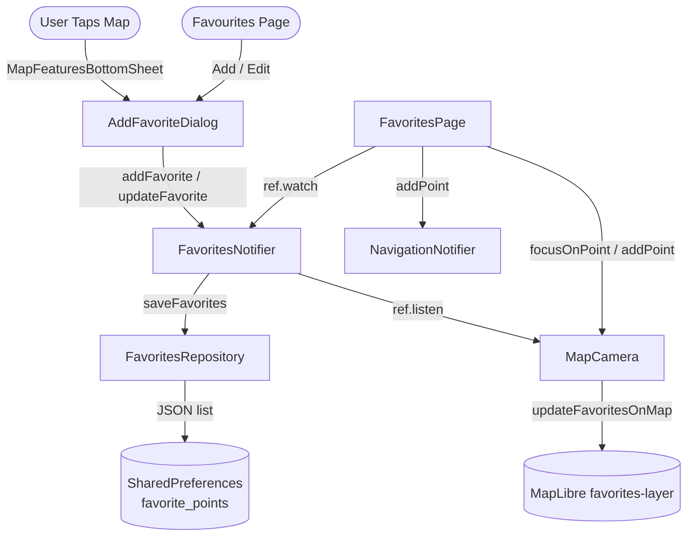

# Favourite Points (Map POI)

This document describes the design, data model, persistence, map integration, and UI of Stork's user-defined favourite points (saved POI markers on the map).

---

## 1. System Overview

Stork lets pilots save points of interest directly from the map and manage them from a dedicated page. Users can:

- Tap anywhere on the map (non-airport locations) and choose **Add to favourites** to store a point with a POI icon, a name, and a formatted description.
- Tap an already-saved favourite marker to view its details from the map bottom sheet.
- List, filter-free view, edit, delete, and show saved points on the map from the **Favourites** page (drawer entry).
- Add a saved point directly into the active navigation route.

Saved points are rendered on the map as POI markers (symbol layer) and persisted locally so they survive restarts and work fully offline.

---

## 2. Architecture and Data Flow

The favourites feature follows the three-layer Clean Architecture (data → domain → presentation) and uses Riverpod for state management:

### 2.1. Domain Models

1.  **[FavoritePoint](../../lib/features/favorites/domain/models/favorite_point.dart)** (Freezed): A single saved point.
    *   `id`: Unique identifier (UUID v4 generated on creation).
    *   `latitude` / `longitude`: Geographic location.
    *   `icon`: POI category represented by `PoiType`.
    *   `name`: Display label.
    *   `description`: Optional free text (defaults to `''`) supporting basic formatting markers `**bold**` and `*italic*`.
    *   Provides `toJson` / `fromJson` for persistence (the `icon` is serialized by enum name).

2.  **[PoiType](../../lib/features/map/domain/models/poi_type.dart)**: The set of POI categories (e.g. `home`, `thermal`, `airfield`, `outlanding`, `fuel`, `restaurant`, `viewpoint`, `camping`, `hospital`, `parking`).
    *   Each value maps to a PNG asset under `assets/images/poi/` (`assetPath`) and to a MapLibre style image id (`mapIconId`, `poi-icon-<name>`).
    *   Lives in the **map** feature domain because it owns the POI assets and map style image registration.

> **Cross-feature dependency note**: `favorites/domain` depends on `map/domain` (`PoiType`), and the map feature (map camera provider / bottom sheet) reads the favourites provider. This is an intentional, documented coupling — the favourites markers are rendered entirely by the map feature's style pipeline. Keeping `PoiType` in `map/domain` is preferred over duplicating it in `favorites/domain`, since it is tightly bound to the map assets and style icon ids.

### 2.2. Data Layer ([FavoritesRepository](../../lib/features/favorites/data/repositories/favorites_repository.dart))

- Persists the whole list as a JSON array under the SharedPreferences key `favorite_points`.
- `loadFavorites()`: reads and decodes the JSON list; returns an empty list on missing/corrupt data (the failure is logged with `debugPrint`, never thrown).
- `saveFavorites()`: encodes and writes the list; throws a `StateError` when the SharedPreferences write reports failure.
- Provided reactively via `favoritesRepositoryProvider` (async), which depends on `sharedPreferencesProvider`.

### 2.3. State Management ([FavoritesNotifier](../../lib/features/favorites/presentation/providers/favorites_provider.dart))

`FavoritesNotifier` is a keep-alive `AsyncNotifier<List<FavoritePoint>>`:

- `build()` loads the persisted list once from the repository.
- `addFavorite(point)`, `updateFavorite(point)`, `removeFavorite(id)` mutate the in-memory list and persist it.

**Persistence-first policy**: all three operations call `saveFavorites` *before* publishing the new state (`state = AsyncData(updated)`). A failed write therefore never leaves a phantom point in the UI list or on the map, and errors propagate to the caller for a snackbar message.

---

## 3. Map Integration

### 3.1. Style Setup ([MapCameraStyle.handleStyleLoaded](../../lib/features/map/presentation/providers/map_camera_style.dart))

On style (re)load the map camera:

1.  Registers every `PoiType` icon via `style.addImageFromAssets(id: type.mapIconId, asset: type.assetPath)` (each failure is caught and logged so one bad asset does not break the map).
2.  Adds the `favorites-source` GeoJSON source (initially an empty `FeatureCollection`).
3.  Adds the `favorites-layer` `SymbolStyleLayer` that renders the POI icon (`icon-image` from the feature property) plus a name label (`text-field: ['get', 'name']`), with overlap/placement allowed and label size scaled by the user `mapFontSize` setting.
4.  Calls `updateFavoritesOnMap()` to seed the layer with the currently saved points.

### 3.2. Rendering Updates ([MapCamera.updateFavoritesOnMap](../../lib/features/map/presentation/providers/map_camera_provider.dart))

- `MapCamera` listens to `favoritesProvider`; on every value change it calls `updateFavoritesOnMap()`, which rebuilds the GeoJSON `FeatureCollection` from the current favourites and pushes it into `favorites-source`.
- The method is guarded (no-op until the map controller, the style, and the aircraft symbol are initialized) to avoid mutating an unready style.

### 3.3. Tap Interaction

`MapCamera._handleMapClick` queries `favorites-layer` with `featuresAtPoint` and appends each hit to the tapped-features list tagged `'layerType': 'favorite'`. The `MapFeaturesBottomSheet` uses this tag to decide which tiles to show (see section 4.1).

### 3.4. Camera Focus ([MapCamera.focusOnPoint](../../lib/features/map/presentation/providers/map_camera_provider.dart))

`focusOnPoint(latitude, longitude, zoom)` moves the camera to a saved point:

1.  Cancels any follow-resume timer and sets `_isFollowPaused = false`.
2.  Switches the map to `MapViewState.overview` (north-up, static "preview" that stops following the aircraft).
3.  Waits for the map controller (via `_controllerCompleter.future`) when the map page is not mounted yet — e.g. when returning from the Favourites page via `context.go('/')`.
4.  Animates the camera to the point with `moveCamera` (pitch 0, bearing 0).

> **Zoom note**: the Favourites page passes the `mapOverviewZoom` setting (default `10.0`) explicitly. This avoids a race with the telemetry listener which would otherwise re-centre the camera to the aircraft in follow mode.

---

## 4. UI Components

### 4.1. Map Bottom Sheet ([MapFeaturesBottomSheet](../../lib/features/map/presentation/components/controls/map_features_bottom_sheet.dart))

- **Add to favourites** tile (star icon) is shown for raw taps, and is **hidden** when tapping an airport or an already-saved favourite point.
- When the tapped feature is a favourite, a **Favourite point** details tile is shown instead (tapping it opens `FavoriteDetailsDialog`).
- The tile name reuses `_getPointName` (airport/place label or raw coordinates as `suggestedName`).

### 4.2. Add / Edit Dialog ([AddFavoriteDialog](../../lib/features/favorites/presentation/dialogs/add_favorite_dialog.dart))

A draggable `BaseDetailsDialog` (`showAddFavoriteDialog` standalone function) containing:

- **Icon chooser**: a wrap of all `PoiType` icons (selected icon highlighted).
- **Name** field with empty-name validation (`pleaseEnterName`).
- **Description** field with a **bold/italic toolbar** that wraps the current selection (or inserts an empty marker pair) using `TextfEditingController` for live WYSIWYG formatting (`textf` package).
- Save button with a busy spinner. On success the dialog pops with the created point.
- In **edit mode** (`initialPoint` provided) it pre-fills the fields and calls `updateFavorite` instead of `addFavorite`.

### 4.3. Details Dialog ([FavoriteDetailsDialog](../../lib/features/favorites/presentation/dialogs/favorite_details_dialog.dart))

A `BaseDetailsDialog` (`showFavoriteDetailsDialog` standalone function) rendering the POI icon, name, coordinates, and the formatted description via the `Textf` widget (falling back to a "No description" hint when empty).

### 4.4. Favourites Page ([FavoritesPage](../../lib/features/favorites/presentation/pages/favorites_page.dart))

- Route `/favorites` registered in [app_router.dart](../../lib/core/router/app_router.dart); drawer entry (`star_outline`) added in [map_drawer.dart](../../lib/features/map/presentation/components/controls/map_drawer.dart).
- Lists all saved points as cards (icon, name, coordinates) with an empty state when there are none.
- Per-point popup menu:
    * **Show on map** — returns to the map and calls `focusOnPoint` (map preview mode).
    * **Add to navigation** — adds a `NavigationPoint` via `navigationProvider.addPoint` with a confirmation/failure snackbar.
    * **Edit** — opens `AddFavoriteDialog` in edit mode.
    * **Delete** — `BaseDetailsDialog` confirm dialog, then `removeFavorite` with error handling.
- Every mutation path shows a snackbar and catches errors (no silent failures).

All dialogs use `BaseDetailsDialog` (frosted-glass, draggable, dark/light aware) per the project UI rules — no raw `AlertDialog` / `SimpleDialog` are used.

---

## 5. Localization

All user-visible strings use `AppLocalizations` keys with the prefix `favorite*`, plus `addToFavorites`, `showOnMap`, and `edit`. Keys are defined in both `lib/l10n/app_en.arb` and `lib/l10n/app_sk.arb` (British spelling "Favourites"). The `favoriteDeleteConfirm` key uses a `{name}` placeholder.

---

## 6. Verification & Tests

| Test Target | File Path | Scope |
| :--- | :--- | :--- |
| **Repository** | [favorites_repository_test.dart](../../test/features/favorites/data/repositories/favorites_repository_test.dart) | Load/save round-trip, empty and corrupt data handling, `StateError` on failed write. |
| **Notifier** | [favorites_test.dart](../../test/features/favorites/presentation/providers/favorites_test.dart) | Add/update/remove semantics, persistence across provider containers, no-op on unknown ids. |
| **Bottom Sheet** | [map_features_bottom_sheet_test.dart](../../test/features/map/presentation/components/controls/map_features_bottom_sheet_test.dart) | "Add to favourites" visibility (hidden for airports and saved points, shown for raw taps). |
