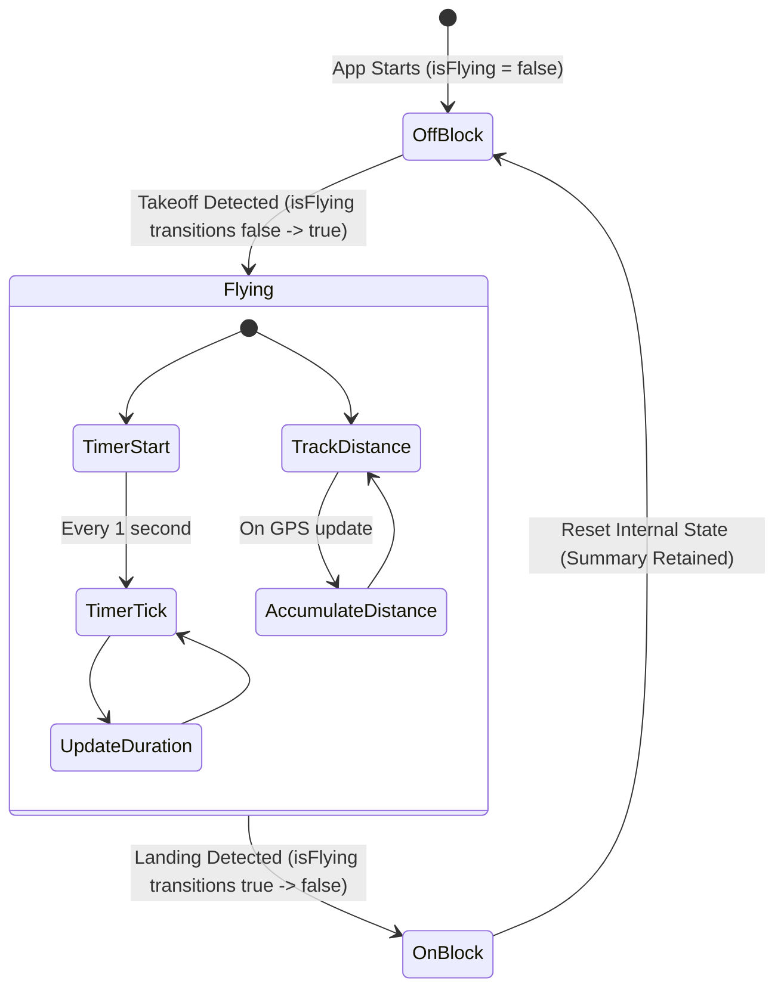

# Flight Duration and Distance Tracking

This document outlines the design and technical implementation of the automated flight time and distance tracking systems in the Stork application.

---

## 1. System Overview

Stork features an automatic flight duration tracker that requires no manual start or stop interactions from the pilot. The system monitors live telemetry to detect when the aircraft takes off and lands, and records:
- **Flight Duration**: The elapsed time since the takeoff event occurred, updated every second and on GPS/telemetry updates.
- **Flight Distance**: The accumulated geographic distance flown by the aircraft, filtering out static GPS drift.
- **Flight Start Time**: The exact timestamp when the flight started.

---

## 2. Architecture and Trigger Logic

The system is managed by the [FlightDuration](../../lib/features/telemetry/presentation/providers/flight_duration_provider.dart) provider, which is annotated as a keep-alive Riverpod notifier ([FlightDurationProvider](../../lib/features/telemetry/presentation/providers/flight_duration_provider.dart)).

### State Machine



### 2.1. Takeoff Detection (Start Flight)
When the `TelemetryState.isFlying` flag transitions from `false` to `true`:
1.  The start time `_flightStartTime` is set to the current device time using `clock.now()`.
2.  Accumulated distance `_distanceMeters` is reset to `0.0`.
3.  Initial latitude and longitude are recorded as the baseline for distance accumulation.
4.  A 1-second periodic `Timer` is spawned. On every tick, it calculates the elapsed duration:
    $$\text{duration} = \text{clock.now()} - \text{_flightStartTime}$$
    and updates the state with a new `FlightSummary`.

### 2.2. Landing Detection (End Flight)
When `TelemetryState.isFlying` transitions from `true` to `false`:
1.  The periodic update timer is canceled.
2.  The final duration is computed.
3.  The final `FlightSummary` is emitted and retained in the provider state (it is not discarded) to reflect the complete flight data.
4.  Internal tracking variables (`_flightStartTime`, `_lastLatitude`, `_lastLongitude`) are reset to `null`.

---

## 3. Geographic Distance Accumulation

While the aircraft is in the `Flying` state, the provider monitors GPS updates to accumulate the distance traveled.

### 3.1. Haversine Formula
The distance between consecutive GPS updates is calculated using the Haversine formula (Earth's radius $R = 6,371,000 \text{ meters}$):

$$\Delta \text{lat} = \text{lat}_2 - \text{lat}_1$$

$$\Delta \text{lon} = \text{lon}_2 - \text{lon}_1$$

$$a = \sin^2\left(\frac{\Delta \text{lat}}{2}\right) + \cos(\text{lat}_1) \cdot \cos(\text{lat}_2) \cdot \sin^2\left(\frac{\Delta \text{lon}}{2}\right)$$

$$c = 2 \cdot \operatorname{atan2}\left(\sqrt{a}, \sqrt{1 - a}\right)$$

$$\text{distance} = R \cdot c$$

### 3.2. GPS Noise Filtering
GPS signals can drift and fluctuate even when the aircraft is stationary on the tarmac. To prevent this noise from artificially inflating the flight distance, the accumulator applies a **1.0-meter floor**:
- The geographic distance between the current coordinate and the last coordinate is calculated.
- The distance is added to the accumulated sum **only if it exceeds 1.0 meter**:
  ```dart
  if (distance > 1.0) {
    _distanceMeters += distance;
  }
  ```
- This filters out high-frequency position jitter while ensuring smooth accumulation during movement.

---

## 4. UI and Dialog Integration

The tracked flight summary is displayed using a map overlay widget and a details dialog:

### 4.1. Flight Time Overlay Widget ([FlightTimeTelemetryWidget](../../lib/features/telemetry/presentation/widgets/flight_time_telemetry_widget.dart))
A floating card positioned on the map view:
- **Monospace Display**: Formats the elapsed time as `HH:MM:SS` using `Duration.toHMSString()` (defined in [time_utils.dart](../../lib/core/utils/time_utils.dart)).
- **Dynamic Opacity (Flight State)**:
  - When the aircraft is flying (`isFlying == true`), the text renders fully opaque (black/white depending on theme).
  - When the aircraft is stationary, the text is drawn with a **76/255 (30%) alpha opacity**. This provides a clear, passive visual cue that the timer is in standby mode.
- **Font Scaling**: Adapts its size and padding dynamically according to `AppSettings.mapFontSize`.

### 4.2. Flight Time Details Dialog ([FlightTimeDetailsDialog](../../lib/features/telemetry/presentation/dialogs/flight_time_details_dialog.dart))
Tapping on the `FlightTimeTelemetryWidget` displays a detail panel showing:
- **Takeoff Time**: The exact timestamp when flight tracking was triggered, formatted to the local timezone.
- **Active Duration**: The total elapsed flight time.
- **Flight Distance**: The accumulated distance flown, converted and formatted in kilometers (e.g. `12.34 km`).
