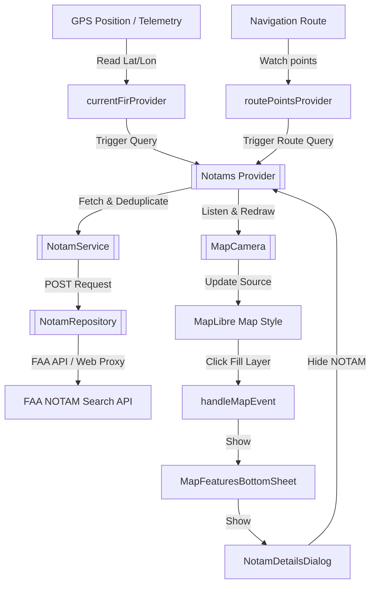

# NOTAM (Notice to Airmen) Technical Documentation

This document describes the models, network synchronization, decoding/translation, Riverpod state management, map rendering, and user interaction system for **NOTAMs (Notice to Airmen / Notice to Air Missions)** in the Stork application.

---

## 1. System Overview

Stork integrates live NOTAM notifications to alert pilots of temporary flight restrictions, airspace hazards, closed runways, or other immediate operational alerts. 

---

## 2. NOTAM Data Models

All NOTAMs in Stork are parsed and stored as strongly-typed Dart objects in the [Notam](../../lib/features/map/domain/models/notam.dart) class. It separates fields into general metadata and decoded specific properties:

### 2.1. Basic Attributes
*   `facilityDesignator`: The code representing the facility (e.g. airport or FIR).
*   `notamNumber`: The reference number of the NOTAM (e.g. `A1234/26`).
*   `featureName`: Descriptive location name.
*   `issueDate`, `startDate`, `endDate`: ISO format date strings returned by the API.
*   `icaoMessage`: The raw, unmodified text message.
*   `status` / `keyword`: Specific FAA status/keywords.

### 2.2. Decoded ICAO Properties
These fields are decoded directly from standard ICAO format sections:
*   `id`: Unique identifier (derived from NOTAM number).
*   `type`: Type of NOTAM (e.g. `NOTAMN` for new, `NOTAMR` for replacement, `NOTAMC` for cancellation).
*   `linkedNotam`: References to previously replaced/canceled NOTAMs.
*   `issuer` (**Field A**): The affected location or airfield.
*   `from` (**Field B**) & `to` (**Field C**): Start and end `DateTime` timestamps in UTC.
*   `schedule` (**Field D**): Operating hours/schedule details when applicable.
*   `msg` (**Field E**): The descriptive message body, with abbreviations expanded to human-readable strings.
*   `lowerLimit2` (**Field F**) & `upperLimit2` (**Field G**): Friendly text boundaries (e.g., `GND`, `FL120`, `1500FT AGL`).
*   `fir` (**Field Q - FIR**): Flight Information Region identifier.
*   `latitude`, `longitude`, `radius` (**Field Q - Coordinates/Radius**): Extracted coordinate point and radius (in meters) representing the geographic circular volume of influence.
*   `flightLevelLowerLimit` & `flightLevelUpperLimit` (**Field Q - Altitude Limits**): Numerical flight level limits parsed from the Q-line.

---

## 3. Data Retrieval & Network Synchronization

### 3.1. FAA NOTAM Search API integration
The repository [HttpNotamRepository](../../lib/features/map/data/repositories/notam_repository.dart) queries the official Federal Aviation Administration (FAA) NOTAM service:
*   **Base URL:** `https://notams.aim.faa.gov/notamSearch/search`
*   **CORS Web Proxy:** On Web platforms, CORS policies are bypassed by wrapping the API call through a secure proxy server: `https://www.stork-nav.app/nocors.php?url=...`
*   **Requests Type:** POST form-urlencoded requests.

The repository provides two query types:
1.  **FIR-Based Queries (`fetchNotamsByFirs`):** Calls the API with `searchType: "0"` and the comma-separated FIR codes in `designatorsForLocation`.
2.  **Point & Radius Queries (`fetchNotamsAroundPoint`):** Calls the API with `searchType: "3"`. Decimal degree coordinates are converted into DMS (Degrees/Minutes/Seconds) and the search radius is converted from meters to Nautical Miles (NM).

### 3.2. Route-Based Fetching Workflow
The [NotamService](../../lib/features/map/domain/services/notam_service.dart) implements a parallel route query:
1.  **FIRs Detection:** Identifies all unique FIRs intersecting the route waypoints.
2.  **Segment Chunking:** The route path is split into intermediate points spaced **50 km** apart using the helper method `FirUtils.getRouteChunkPoints`.
3.  **Parallel Fetching:** Fires concurrent API requests for both the FIR-based NOTAM list and coordinate-based NOTAMs (with a 50 km radius) surrounding each chunk waypoint.
4.  **Deduplication:** Awaits all parallel futures and deduplicates returned NOTAMs by their unique ID to present a unified list.

---

## 4. Decoding and Translations

To make cryptic ICAO NOTAM text user-friendly, Stork uses the [NotamDecoder](../../lib/features/map/data/utils/notam_decoder.dart) to parse standard fields and expand contractions.

### 4.1. Message Parsing
*   `separateToParts(rawMessage)` uses index markers to isolate specific ICAO fields (`Q)`, `A)`, `B)`, `C)`, `D)`, `E)`, `F)`, `G)`).
*   `parseIcaoDate` decodes the 10-character YYMMDDHHMM timestamp format (e.g. `2603251315` -> `2026-03-25T13:15:00Z`).
*   If Q-line coordinates are present (at least 14 characters), the decoder extracts latitude (2-digit degrees, 2-digit minutes, direction), longitude (3-digit degrees, 2-digit minutes, direction), and radius (3-digit Nautical Miles), then converts them to decimal coordinates and meters.

### 4.2. Contraction Expansions
The decoder includes `decodeMessage()` which scans the message body (Field E) using a regular expression match on uppercase words. It maps aviation contractions to full terms using a dictionary of over 350 terms in [notam_translations.dart](../../lib/features/map/data/utils/notam_translations.dart):
*   `AD` -> `Aerodrome`
*   `CLSD` -> `Closed`
*   `WIP` -> `Work in progress`
*   `PJE` -> `Parachute jumping exercise`

---

## 5. State Management (Riverpod)

The application coordinates live NOTAM states using Riverpod providers in [notams_provider.dart](../../lib/features/map/presentation/providers/notams_provider.dart).

### 5.1. Performance-Optimized GPS Tracking
To prevent reloading NOTAMs repeatedly over minor GPS position shifts:
*   `currentFirProvider` watches `telemetryProvider` only for **GPS fix validity** changes (e.g., transitioning from no signal to active signal), and watches `routePointsProvider` for active navigation alterations.
*   The actual coordinates are read via `ref.read(telemetryProvider)` only when a recalculation is triggered by these structural watchers. This avoids querying new FIR polygons or making network fetches on every step or bearing change.

### 5.2. Auto-Hiding and Expiration Mechanism
Users can temporarily or permanently hide NOTAMs they have already read or deemed irrelevant.
*   **Persistent Registry:** Hiding a NOTAM calls `hideNotam(notam)`. It saves the NOTAM's ID mapped to its expiration (`to`) ISO timestamp in `SharedPreferences` under the key `hidden_notam_expirations`.
*   **Automatic Cleanup:** During startup, the provider reads the registry, compares timestamps to `DateTime.now()`, deletes expired entries from the settings to prevent memory bloat, and returns the list of active hidden IDs.
*   **Filtering:** The `Notams` provider filters the API-fetched list against the active hidden set before supplying the data to UI layers.

---

## 6. Map Rendering & Interaction

### 6.1. Map Style and Layers Configuration
In [map_camera_style.dart](../../lib/features/map/presentation/providers/map_camera_style.dart), two visual layers are registered:
1.  **`notams-fill-layer` (FillStyleLayer):** Renders a solid semitransparent orange/red area (`#FF5722`, opacity `0.25`) representing the geographic scope of active NOTAMs.
2.  **`notams-line-layer` (LineStyleLayer):** Renders a dashed boundary outline (`#FF5722`, line-width `2.0`, dasharray `[2.0, 2.0]`) to clearly delimit the hazard boundary.

### 6.2. Circle Geometry Construction
Since NOTAM regions are defined by a coordinate center and a nautical mile radius, the [MapCamera.updateNotamsOnMap](../../lib/features/map/presentation/providers/map_camera_provider.dart) method generates a 32-segment circle polygon for each NOTAM:
$$\text{destLat} = \arcsin\left(\sin(\text{lat}) \cos(d) + \cos(\text{lat}) \sin(d) \cos(\theta)\right)$$
$$\text{destLon} = \text{lon} + \arctan2\left(\sin(\theta) \sin(d) \cos(\text{lat}), \cos(d) - \sin(\text{lat}) \sin(\text{destLat})\right)$$
*(where $d$ is the angular distance $\frac{\text{radius}}{\text{Earth's Radius}}$ and $\theta$ is the angle for each of the 32 segments)*.

These geometries are serialized into a GeoJSON `FeatureCollection` and updated via `updateGeoJsonSource(id: 'notams-source', ...)`.

### 6.3. Tapping Map Features
When a click event is registered, `MapCamera.handleMapEvent` performs a hit-test:
*   Queries features at the tapped screen point overlapping `'notams-fill-layer'`.
*   Tapped features are packaged with their properties (including the NOTAM `id` and metadata) and sent to the interactive bottom sheet.

---

## 7. UI Components

### 7.1. Map Features Bottom Sheet
The [MapFeaturesBottomSheet](../../lib/features/map/presentation/components/controls/map_features_bottom_sheet.dart) gathers tapped layers:
*   Extracts NOTAM layers using the custom pattern-matching helper `_findNotamFeatures()`.
*   Presents a list item with a warning icon (`Icons.warning_amber_rounded`) and details summary.
*   Tapping the item opens the full modal details dialog.

### 7.2. NOTAM Details Dialog
The [NotamDetailsDialog](../../lib/features/map/presentation/components/dialogs/notam_details_dialog.dart) renders full metadata for one or more stacked active NOTAMs:
*   **Vertical Limits Indicator:** Translates lower and upper limits.
*   **Validity Details:** Formats and displays localized start/end times.
*   **Decoded Text Block:** Renders the contractions-expanded text body.
*   **"Hide NOTAM" Action:** A prominent button that immediately hides the NOTAM and registers it to persistent memory. If all queried NOTAMs are hidden, the dialog dismisses itself.

---

## 8. Verification & Tests

The NOTAM engine is verified under the following automated test suites:

| Target Component | Test File | Scope |
| :--- | :--- | :--- |
| **Data Decoder** | [notam_decoder_test.dart](../../test/features/map/data/utils/notam_decoder_test.dart) | Asserts parsing accuracy of raw FAA responses, coordinate extraction, date conversions, and contraction translations. |
| **Data Repository** | [notam_repository_test.dart](../../test/features/map/data/repositories/notam_repository_test.dart) | Mocks FAA HTTP API query responses and checks serialization/deserialization. |
| **Deduplication Service** | [notam_service_test.dart](../../test/features/map/domain/services/notam_service_test.dart) | Simulates navigation routes and verifies parallel waypoint fetching and deduplication. |
| **Riverpod State Provider** | [notams_provider_test.dart](../../test/features/map/presentation/providers/notams_provider_test.dart) | Asserts FIR-based reactivity, GPS-trigger optimization, and persistent hiding registry operations. |
| **Details UI** | [notam_details_dialog_test.dart](../../test/features/map/presentation/components/dialogs/notam_details_dialog_test.dart) | Tests rendering of single/multiple NOTAM items and confirms hide callbacks are invoked properly. |
