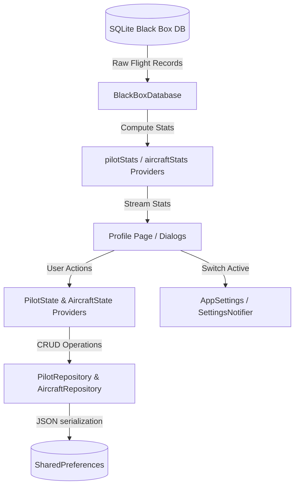

# Pilot and Aircraft Management

This document details the technical implementation of the Pilot and Aircraft management system in the Stork application.

---

## 1. System Overview

To provide accurate flight logging, Stork allows pilots to create profiles for themselves and their aircraft. These profiles are used to:
1.  **Track Totals**: Maintain historical records of flight hours and flight counts.
2.  **Filter Flights**: Categorize recorded flights under a specific pilot and aircraft.
3.  **Ensure Privacy/Security**: Secure pilot profiles with optional numeric PIN codes to prevent unauthorized switching or deletions.

---

## 2. Architecture and Data Flow

The feature is built on a clean separation between reactive UI components, state management providers, local configuration settings, and database storage:



### 2.1. Domain Models

Both models are defined immutably using the `freezed` and `json_serializable` packages:

1.  **[Pilot](../../lib/features/settings/domain/models/pilot.dart)**: Represents a pilot profile.
    -   `id`: Unique UUID (v4) identifier.
    -   `name`: Display name of the pilot.
    -   `pin`: Optional security PIN code string (stored as plain text locally).
    -   `initialFlightHours`: Pre-existing flight hours logged outside of the app.
    -   `initialFlights`: Pre-existing flight counts logged outside of the app.
2.  **[Aircraft](../../lib/features/settings/domain/models/aircraft.dart)**: Represents an aircraft profile.
    -   `id`: Unique UUID (v4) identifier.
    -   `name`: Registration number or name of the aircraft.
    -   `initialFlightHours`: Pre-existing airframe hours logged outside of the app.
    -   `initialFlights`: Pre-existing flight count logged outside of the app.

### 2.2. Profile Persistence Layer

Profile metadata is stored in `SharedPreferences` as a serialized JSON list of items, handled by their respective repository wrappers:
-   **[PilotRepository](../../lib/features/settings/data/repositories/pilot_repository.dart)**: Manages read, write, and delete operations under the `'app_pilots'` storage key.
-   **[AircraftRepository](../../lib/features/settings/data/repositories/aircraft_repository.dart)**: Manages read, write, and delete operations under the `'app_aircrafts'` storage key.

### 2.3. Active Profile Settings

The currently selected pilot and aircraft are tracked at the application configuration level within `AppSettings` (`pilotId` and `airplaneId`). Selecting a new profile updates these identifiers in `SharedPreferences`, causing the telemetry recording systems and dashboard widgets to automatically associate subsequent flights with the newly active profile.

---

## 3. Flight Database Association

When a flight recording begins or is saved in the SQLite database, it is associated with the active profiles:
-   The `flights` table schema in [black_box_database_io.dart](../../lib/core/services/database/black_box_database_io.dart) has been upgraded to include `pilot_id` (TEXT) and `airplane_id` (TEXT) columns.
-   An index `idx_flights_pilot_id` is created on the `pilot_id` column to optimize queries filtering flight lists by pilot.
-   When flights are queried or saved, [Flight](../../lib/features/telemetry/domain/models/flight.dart) models map these columns to `pilotId` and `airplaneId`.

---

## 4. Time-Based Statistics

To compute total airtime and flight count stats, the application fetches information dynamically from the database and adds the pilot/aircraft's initial configuration values.

### 4.1. Calculations Grid

Statistics are computed in a single unified SQL query across five distinct temporal intervals. The raw metrics are defined by the **[TimeBasedStats](../../lib/features/telemetry/domain/models/time_based_stats.dart)** class:
-   **Today**: Flights starting on or after the current calendar day at `00:00:00` local time (mapped to UTC).
-   **This Week**: Flights starting on or after Monday of the current week.
-   **This Month**: Flights starting on or after the 1st of the current month.
-   **This Year**: Flights starting on or after January 1st of the current year.
-   **All-Time**: All flights linked to this specific profile ID, plus the profile's configured `initialFlightHours` / `initialFlights`.

### 4.2. Database Statistics Query

The SQL statistics computation in the local database calculates duration intervals and counts using Julian dates:

```sql
WITH flight_durations AS (
  SELECT 
    start_time,
    (julianday(COALESCE(end_time, ?)) - julianday(start_time)) * 24.0 as hours
  FROM flights
  WHERE pilot_id = ? -- Or airplane_id = ?
)
SELECT 
  SUM(hours) as total_hours,
  COUNT(*) as total_flights,
  
  SUM(CASE WHEN start_time >= ? THEN hours ELSE 0 END) as year_hours,
  SUM(CASE WHEN start_time >= ? THEN 1 ELSE 0 END) as year_flights,
  
  SUM(CASE WHEN start_time >= ? THEN hours ELSE 0 END) as month_hours,
  SUM(CASE WHEN start_time >= ? THEN 1 ELSE 0 END) as month_flights,
  
  SUM(CASE WHEN start_time >= ? THEN hours ELSE 0 END) as week_hours,
  SUM(CASE WHEN start_time >= ? THEN 1 ELSE 0 END) as week_flights,
  
  SUM(CASE WHEN start_time >= ? THEN hours ELSE 0 END) as today_hours,
  SUM(CASE WHEN start_time >= ? THEN 1 ELSE 0 END) as today_flights
FROM flight_durations;
```

---

## 5. PIN Security Layer

Security controls are built to prevent accidentally deleting a pilot profile or switching profiles without authorization.

-   **PIN Configuration**: Managed in the [PilotSettingsDialog](../../lib/features/settings/presentation/dialogs/pilot_settings_dialog.dart). If a pilot enters a numeric value, it is assigned as the security PIN.
-   **Prompt Triggering**: In [pin_prompt_dialog.dart](../../lib/features/settings/presentation/dialogs/pin_prompt_dialog.dart), calling `promptForPin` opens a dialog prompting the user for the numeric PIN if the selected pilot has a PIN configured.
-   **Enforcement Actions**:
    -   **Switching Pilot**: Selecting a PIN-locked pilot in the bottom sheet prompts for PIN entry.
    -   **Deleting Pilot**: Attempting to delete a PIN-locked pilot profile requires entering their security PIN first.

---

## 6. User Interface Integration

The UI features a dedicated profile page and modal sheets:

### 6.1. Profile Page ([ProfilePage](../../lib/features/settings/presentation/pages/profile_page.dart))
Accessible from the drawer or the app's settings menu under `/profile`:
-   **Header Card ([ProfileHeaderCard](../../lib/features/settings/presentation/components/profile_header_card.dart))**:
    -   Shows current active pilot and active aircraft.
    -   Displays status details (e.g. "PIN Protected" badge) and overall total flight hours.
    -   Hosts dropdown controls for switching the active profile and icons to edit settings or delete.
-   **Stats Dashboard ([StatsDashboard](../../lib/features/settings/presentation/components/stats_dashboard.dart))**:
    -   Presents a layout grid displaying comparative time-based statistics (Today, Week, Month, Year, All-time) for both flight hours and flight counts.

### 6.2. Switching Profiles Bottom Sheets
-   **[SwitchPilotBottomSheet](../../lib/features/settings/presentation/dialogs/switch_pilot_bottom_sheet.dart)**: Lists all configured pilots. Tapping a pilot updates the active profile (prompting for a PIN if configured). Provides an action to launch the `CreatePilotDialog`.
-   **[SwitchAircraftBottomSheet](../../lib/features/settings/presentation/dialogs/switch_aircraft_bottom_sheet.dart)**: Lists all registered aircraft. Tapping switches the active aircraft. Provides an action to launch the `CreateAircraftDialog`.

### 6.3. Flight Records & Filters ([FlightRecordsPage](../../lib/features/telemetry/presentation/pages/flight_records_page.dart))
-   **Display Details**: Expanded flight record tiles show the registered pilot name and aircraft name instead of raw UUID strings, along with flight-specific text notes.
-   **Filters Bar**: A top filtering drawer lets the user filter the flight records list by:
    -   *Pilot*: All, Anonymous, or specific pilot profiles.
    -   *Aircraft*: All, Unknown, or specific aircraft profiles.
-   **Edit Details ([EditFlightDialog](../../lib/features/telemetry/presentation/dialogs/edit_flight_dialog.dart))**: Allows updating the name, pilot profile, aircraft profile, and custom notes for any recorded flight.

### 6.4. Sidebar Menu ([MapDrawer](../../lib/features/map/presentation/components/controls/map_drawer.dart))
The header in the side drawer displays:
-   The current active pilot name and active aircraft name.
-   Quick totals of pilot and aircraft flight hours.
-   An interactive tap behavior that navigates directly to `/profile`.
