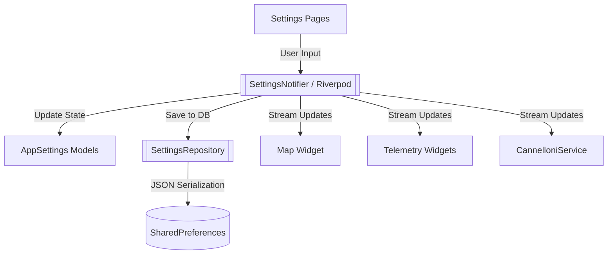

# Settings and Configuration

This document outlines the technical implementation of the user configuration and settings system in the Stork application.

---

## 1. System Overview

The Settings feature allows pilots and operators to configure the application's behavior, visual layout, and avionics network integration. The settings are persisted locally and managed reactively, ensuring that any configuration change (such as switching units from meters to feet) is instantly reflected across the entire application interface.

## 2. Architecture and Data Flow

Settings are built using a clean architecture approach, separating domain models, data persistence, and reactive providers:

### 2.1. Domain Models

The configuration is strictly typed and immutable, generated using the `freezed` and `json_serializable` packages:

1. **[AppSettings](../../lib/features/settings/domain/models/app_settings.dart)**: The root configuration model. Contains all primitive settings (font sizes, default zoom levels, active units) and nests the complex sub-models.
2. **[RangeThresholds](../../lib/features/settings/domain/models/range_thresholds.dart)**: Defines the safety alert boundaries (e.g., `minWarning`, `maxError`) for telemetry metrics. The model enforces strict runtime validation to ensure boundaries are logically sorted (e.g., a warning cannot exceed an error limit).
3. **[CannelloniDevice](../../lib/features/settings/domain/models/cannelloni_device.dart)**: Models a network bridge for DroneCAN telemetry, storing the target `ipAddress`, `port`, and user-friendly `name`.
4. **[WidgetPosition](../../lib/features/settings/domain/models/widget_position.dart)**: Stores the generic `top` and `left` pixel coordinates for all draggable overlay widgets on the map.

### 2.2. Units of Measurement

Stork supports multiple aviation units. These are modeled as enums:
- **[AltitudeUnit](../../lib/features/settings/domain/models/altitude_unit.dart)**: Supports `meters`, `feet`, and `flightLevel`.
- **[SpeedUnit](../../lib/features/settings/domain/models/speed_unit.dart)**: Supports `kmh` (km/h), `mph`, and `knots`.
- **[TemperatureUnit](../../lib/features/settings/domain/models/temperature_unit.dart)**: Supports `celsius` (°C), `kelvin` (K), and `fahrenheit` (°F) for engine temperature indicators (oil temp, CHT, EGT).
- **[PressureUnit](../../lib/features/settings/domain/models/pressure_unit.dart)**: Supports `bar`, `psi`, and `kPa` for engine oil pressure indicators.

The `app_settings` model stores the user's preferred units, and formatting extensions automatically translate raw SI units (Kelvin, kPa) into the correct display string.

## 3. Persistence Layer

The settings are saved using the `shared_preferences` package, abstracted behind the [SettingsRepository](../../lib/features/settings/data/repositories/settings_repository.dart).

- **Serialization**: The entire `AppSettings` object is converted to a JSON map using the generated `.toJson()` method.
- **Deserialization**: On application startup, the repository reads the JSON string and reconstructs the object via `AppSettings.fromJson()`. If no preferences exist, it yields the default settings template.

## 4. UI Implementation

To prevent a single cluttered screen, the configuration is split into modular pages accessed via the main [SettingsPage](../../lib/features/settings/presentation/settings_page.dart):

### 4.1. Flight Settings ([FlightSettingsPage](../../lib/features/settings/presentation/pages/flight_settings_page.dart))
Manages aircraft-specific configurations:
- **Unit Selectors**: Dropdowns for Speed, Altitude, Height, Temperature, and Pressure units.
- **Safety Thresholds**: Complex, custom-painted [ThresholdsSlider](../../lib/features/settings/presentation/widgets/thresholds_slider.dart) inputs that allow intuitive dragging of multiple thumbs to set safe operational limits and warning/error thresholds for:
  - **Flight Speed**: Minimum/maximum safe velocities.
  - **Engine RPM**: Operating speed boundaries.
  - **Oil Temperature & Pressure**: Lubrication health metrics.
  - **Cylinder Head Temp (CHT) & Exhaust Gas Temp (EGT)**: Engine thermal health.
  - **Fuel Level**: Alert triggers for low fuel level percentages.
- **Max Slider Ranges**: Configurable upper boundaries for sensor sliders, allowing customization per-aircraft capacity.

### 4.2. Map Settings ([MapSettingsPage](../../lib/features/settings/presentation/pages/map_settings_page.dart))
Manages visual and layout preferences:
- **Zoom Levels**: Sliders configuring the initial, overview, and follow-mode zoom levels.
- **Typography**: Adjusts the `mapFontSize` which dynamically scales the text inside the glassmorphic telemetry cards.
- **Widget Layout Controls**: A toggle to enable/disable widget dragging (`areWidgetsDraggable`) and a reset button to restore default widget positions.

### 4.3. Gateway Settings ([GatewaySettingsPage](../../lib/features/settings/presentation/pages/gateway_settings_page.dart))
Manages network connectivity:
- **Auto-Discovery Toggle**: Enables or disables mDNS network scanning.
- **Device Selection**: A dropdown list populated with discovered `CannelloniDevice` instances, allowing the user to select the active telemetry source.
