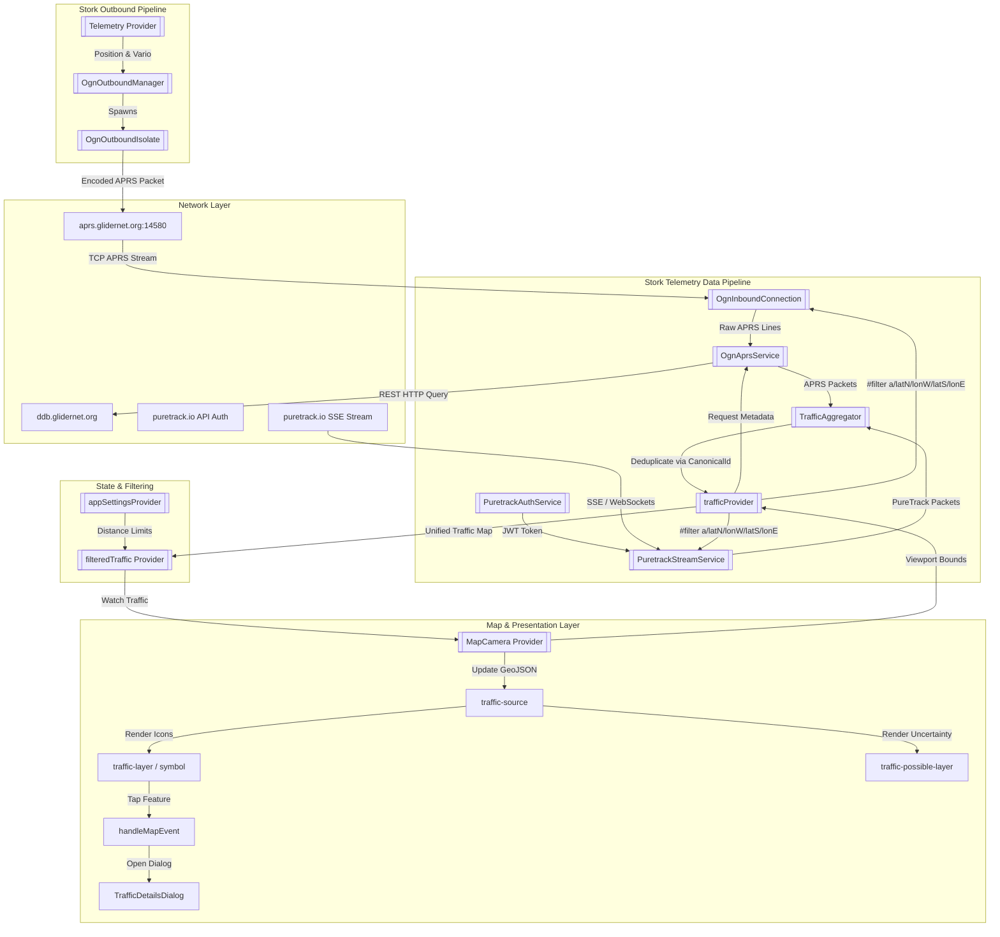
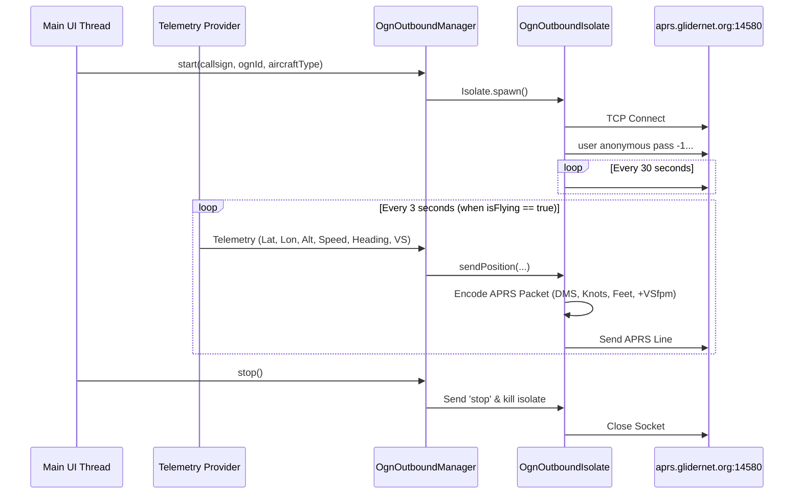

# Multi-Source Traffic Monitoring and Live Beaconing Technical Documentation

This document describes the network protocols, APRS and SSE telemetry decoding, Open Glider Network (OGN) Device Database integration, PureTrack integration, background Isolate-based live beaconing, canonical ID deduplication, Riverpod state management, map rendering, trajectory projection, and UI components for **Traffic System** in the Stork application.

---

## 1. System Overview

Stork integrates live aircraft traffic tracking from multiple telemetry networks (**Open Glider Network (OGN)** APRS and **PureTrack** SSE/WebSocket stream) and bidirectional position sharing. The application receives live telemetry for surrounding gliders, tow planes, helicopters, paragliders, and powered aircraft across both sources, aggregates and deduplicates aircraft targets in real time, while optionally broadcasting the pilot's own position to enhance situational awareness and collision avoidance.



---

## 2. Telemetry Ingest & Viewport Filtering

### 2.1. OGN APRS Inbound Connection
The class [OgnInboundConnection](../../lib/features/telemetry/data/ogn_aprs_service.dart#L280) manages an active TCP socket connection to the OGN APRS core servers:
*   **Host & Port:** `aprs.glidernet.org:14580`
*   **Authentication Handshake:** Upon connection, the socket sends:
    ```text
    user anonymous pass -1 vers storknav 1.0\r\n
    ```
*   **Stream Processing:** Decodes UTF-8 byte streams into raw line frames using `LineSplitter()`.
*   **Reconnection Logic:** Handles disconnects and socket errors gracefully. The provider [trafficProvider](../../lib/features/telemetry/presentation/providers/traffic_provider.dart) schedules reconnections using an exponential backoff strategy (retrying every 2s up to 30s).

### 2.2. PureTrack Service Integration & Streaming
Stork integrates PureTrack live tracking via [PuretrackAuthService](../../lib/features/telemetry/data/puretrack_auth_service.dart) and [PuretrackStreamService](../../lib/features/telemetry/data/puretrack_stream_service.dart).

*   **Authentication & Token Management:**
    *   [PuretrackAuthService](../../lib/features/telemetry/data/puretrack_auth_service.dart) manages REST API authentication, login credential validation, token caching, invalidation, and session freshness checks.
    *   If authentication is required or credentials expire, [PureTrackAuthBanner](../../lib/features/telemetry/presentation/widgets/puretrack_auth_banner.dart) displays an interactive alert in the UI for re-authentication.
    *   `PuretrackAuthService` manages HTTP client ownership cleanly, preserving external client instances on `dispose()`.
*   **SSE / WebSocket Stream Handling:**
    *   [PuretrackStreamService](../../lib/features/telemetry/data/puretrack_stream_service.dart) connects using a JWT token to stream real-time JSON packets.
    *   Incoming packets are parsed into [PureTrackPacket](../../lib/features/telemetry/data/puretrack_stream_service.dart) objects with robust numeric parsing capability (handling numbers, strings, and missing values safely).

### 2.3. Dynamic Spatial Viewport Filtering
To minimize cellular data usage and server overhead, Stork dynamically updates server-side APRS and SSE filters so that only aircraft within or near the active map viewport are received from both networks.

*   **Filter Command Format:** `#filter a/latN/lonW/latS/lonE` (specifying North, West, South, and East bounding limits in decimal degrees formatted to 4 decimal places).
*   **Update Triggers:**
    1.  **Immediate Shift Trigger:** Sent instantly if the camera center shifts by more than $1500\text{ m}$ (`kOgnFilterSignificantShiftMeters`) or if more than $15\text{ s}$ (`kOgnFilterMaxUnsentDuration`) have passed since the last filter update.
    2.  **Debounced Panning Trigger:** Uses a trailing $1\text{ s}$ debounce timer (`kOgnFilterDebounceDuration`) for minor manual panning or zooming interactions.

---

## 3. Data Parsing, Multi-Source Aggregation & Deduplication

### 3.1. APRS & PureTrack Telemetry Decoding
*   **APRS Decoding:** Raw APRS lines are parsed by `parseAprsLine` in [OgnAprsService](../../lib/features/telemetry/data/ogn_aprs_service.dart#L429), extracting callsign, UTC timestamp, high-precision coordinates, altitude, ground speed, heading, and OGN commentary flags (stealth, no-tracking, aircraft type, vertical speed).
*   **PureTrack Decoding:** Stream JSON objects are decoded in [PuretrackStreamService](../../lib/features/telemetry/data/puretrack_stream_service.dart), mapping PureTrack telemetry fields (latitude, longitude, altitude, speed, track, vertical speed, aircraft category) into standardized values.

### 3.2. Multi-Source Aircraft Domain Model (`TrafficAircraft`)
Parsed traffic from all networks is unified into the [TrafficAircraft](../../lib/features/telemetry/domain/models/traffic_aircraft.dart) domain model:
*   `id`: Canonical unique identifier.
*   `callsign`: Raw callsign or tail number.
*   `registration`, `aircraftModel`, `cn`: Resolved aircraft metadata.
*   `latitude`, `longitude`, `altitude`: Current position and MSL altitude in meters.
*   `track`, `groundSpeed`, `verticalSpeed`: Kinematic vectors.
*   `aircraftType`: Integer category code mapped via `AircraftType.fromOgnCode(code)`.
*   `trafficSource`: Enum specifying source provider ([TrafficSource.ogn](../../lib/features/telemetry/domain/models/traffic_aircraft.dart) or [TrafficSource.pureTrack](../../lib/features/telemetry/domain/models/traffic_aircraft.dart)).
*   `lastSeen`: UTC timestamp of the last packet.
*   `isAnonymous`: Privacy flag.

### 3.3. Canonical ID Resolution & Deduplication
Because the same physical aircraft can be reported simultaneously by OGN and PureTrack, Stork uses [CanonicalId](../../lib/features/telemetry/domain/utils/canonical_id.dart) and [TrafficAggregator](../../lib/features/telemetry/domain/repositories/traffic_aggregator.dart) to deduplicate aircraft targets:
*   **Canonical Keys:** Merges records based on matching registration, contest number, or hardware hex ID.
*   **State Aggregation:** When a target update arrives, `TrafficAggregator` updates existing target properties or adds new entries while keeping track histories aligned.
*   **History Cleanup:** When stale targets are evicted (targets inactive for $> 10\text{--}15\text{ minutes}$), `TrafficAggregator` purges evicted canonical IDs from `_trackHistories` to prevent memory leaks.

---

## 4. OGN Device Database (DDB) Integration

Because raw telemetry packets carry limited identification, Stork asynchronously queries the official Open Glider Network Device Database (DDB) to resolve tail numbers and aircraft models.

### 4.1. DDB Query Mechanics
*   **Endpoint:** `https://ddb.glidernet.org/download/?j=1&device_id=ID1,ID2,...`
*   **HTTP Method:** GET request with batch comma-separated device IDs.
*   **User-Agent:** `stork-aprs-app/1.0.0 (https://github.com/vjoba/stork)`
*   **Caching:** Resolved entries are stored in an in-memory `_ddbCache` dictionary in [OgnAprsService](../../lib/features/telemetry/data/ogn_aprs_service.dart#L368) to eliminate redundant network fetches.

### 4.2. Resolved Fields
*   `registration`: Tail number (e.g. `OM-1234`).
*   `aircraft_model` $\rightarrow$ `aircraftModel`: Type designation (e.g. `Discus 2c`, `WT9 Dynamic`).
*   `cn`: Glider competition / contest number (e.g. `77`).

---

## 5. Outbound Tracking (Live Position Broadcast)

Stork supports broadcasting the pilot's own telemetry to the OGN APRS network so other aircraft and ground tracking stations (e.g. LiveTrack24, OGN Viewer) can see the aircraft.



### 5.1. Background Isolate Architecture
To eliminate UI frame drops caused by socket network operations, live position broadcasting runs entirely within a dedicated background Dart `Isolate`:
*   [OgnOutboundIsolate](../../lib/features/telemetry/data/ogn_aprs_service.dart#L96): Manages the background TCP socket, performs format conversion, sends periodic `# keepalive\r\n` pings every $30\text{ s}$, and transmits position packets.
*   [OgnOutboundManager](../../lib/features/telemetry/data/ogn_aprs_service.dart#L224): Controls spawning, message passing across `SendPort`/`ReceivePort` pairs, and teardown.

### 5.2. Outbound APRS Encoding
Every $3\text{ s}$, if `telemetry.isFlying` is `true`, the isolate formats and sends a standard APRS frame:
*   **Callsign Formatting:** Uses `OGN` + 6-hex OGN ID (or existing `ICA`/`FLR` prefix).
*   **Coordinate Encoding:** Converts decimal degrees into Degrees/Minutes/Direction (`DDMM.mmN` / `DDDMM.mmE`).
*   **Unit Conversions:**
    *   Speed: $\text{m/s} \rightarrow \text{knots}$ ($\times 1.94384$).
    *   Altitude: $\text{meters} \rightarrow \text{feet}$ ($\times 3.28084$).
    *   Vario: $\text{m/s} \rightarrow \text{feet per minute}$ ($\times 196.8504$).
*   **Comment String:** `idXXYYYYYY +VSfpm` (encodes aircraft type byte `XX` and 6-hex `YYYYYY` ID).

### 5.3. Activation Requirements
Outbound beaconing starts automatically when:
1.  An active aircraft is selected in settings.
2.  `aircraft.sendLivePosition` is enabled (`true`).
3.  `aircraft.ognDeviceId` is a valid 6-character hexadecimal string (e.g. `012345`).
4.  GPS telemetry reports valid coordinates and `telemetry.isFlying == true`.

---

## 6. Riverpod State Management & Filtering

### 6.1. Providers Overview
1.  `ognAprsServiceProvider`: Provides the singleton `OgnAprsService` instance.
2.  `puretrackAuthServiceProvider`: Provides the `PuretrackAuthService` instance.
3.  `puretrackAuthProvider`: Manages authentication state (credentials, JWT tokens, login status).
4.  `trafficProvider` ([TrafficNotifier](../../lib/features/telemetry/presentation/providers/traffic_provider.dart#L29)): Keeps an active in-memory map (`_aircraftMap`) of all aggregated aircraft across OGN and PureTrack. Manages connections, decay timers, DDB lookups, and outbound beaconing state. Maintains `_ownshipTrackHistory` for ownship turn rate calculation.
5.  `filteredTrafficProvider` ([filteredTraffic](../../lib/features/telemetry/presentation/providers/traffic_provider.dart#L348)): Applies spatial distance filters and runs 3D collision threat evaluations via `CasEvaluator.evaluateThreat` for all targets.
6.  `activeCollisionAlertProvider` ([activeCollisionAlert](../../lib/features/telemetry/presentation/providers/traffic_provider.dart#L461)): Filters all active traffic threats, sorts targets by shortest $t_{\text{CPA}}$ and closest minimum separation distance, returning the highest-priority collision threat.

### 6.2. Spatial Filtering & CAS Threat Evaluation Logic
`filteredTraffic` filters and evaluates the raw list using preferences defined in `AppSettings`:
*   **Horizontal Distance Filter:** Rejects targets exceeding `trafficMaxHorizontalDistance` (default $50000\text{ m} / 50\text{ km}$).
*   **Vertical Distance Filter:** Rejects targets exceeding `trafficMaxVerticalDistance` (default $1500\text{ m}$).
*   **3D Threat Evaluation:** Calculates turn rates ($\omega$), detects sustained thermal circling, predicts 3D kinematic trajectories, and evaluates closest point of approach ($t_{\text{CPA}}$ and $d_{\text{CPA}}$). For comprehensive mathematical details, see [Collision Avoidance System Documentation](collision-avoidance-system.md).

---

## 7. Map Rendering & Trajectory Projection

The MapLibre integration handles traffic visualization in [map_camera_style.dart](../../lib/features/map/presentation/providers/map_camera_style.dart#L183) and [map_camera_provider.dart](../../lib/features/map/presentation/providers/map_camera_provider.dart#L528).

### 7.1. Layer Architecture
*   **`traffic-source`:** GeoJSON source holding target points with feature properties (`id`, `heading`, `icon-image`, `altitudeTag`, `isThreat`, `possiblePositionRatio`).
*   **`traffic-layer`:** Symbol layer rendering custom aircraft icons rotated according to target track (`heading`) and displaying dynamic relative altitude tags (`altitudeTag`) for active threats.
*   **`traffic-possible-layer`:** Symbol layer rendering position uncertainty rings when lookahead projection is active.

### 7.2. Icon Registration, Category Styling & Threat Highlighting
`MapCameraStyleNotifier` dynamically generates and registers tinted icon assets for all 13 `AircraftType` categories:
*   **Active Traffic (Flying, $GS > 1.0\text{ m/s}$):** Colored aircraft icon (`type.trafficMapIconId`).
*   **Inactive / Stationary Traffic ($GS \le 1.0\text{ m/s}$):** Grey-tinted icon (`type.inactiveTrafficMapIconId`).
*   **Collision Threat Targets (`isCollisionThreat == true`):** Highlighted threat icon (`type.threatTrafficMapIconId`) and bold red altitude tag text (`#FF3333` with black halo outline).

### 7.3. Trajectory Lookahead Vector
To compensate for network latency and depict true relative movement, Stork projects each aircraft's estimated future position:
*   **Lookahead Constant:** `kTrafficLookaheadPeriodSeconds = 10.0` seconds.
*   **Distance Projection:** $\text{distance} = \text{groundSpeed} \times (\text{elapsedSeconds} + 10.0)$.
*   **Position Ratio:** Calculated relative to icon size (`kTrafficBaseIconSizePx = 64.0`) to scale the `traffic-possible-layer` circle radius appropriately.

---

## 8. Interactive User Interface

### 8.1. Details Dialog (`TrafficDetailsDialog`)
Tapping an aircraft icon on the map queries features from `traffic-layer` and opens [TrafficDetailsDialog](../../lib/features/map/presentation/components/dialogs/traffic_details_dialog.dart#L15).

```text
+---------------------------------------------------+
| ✈ Traffic Details                             [X] |
+---------------------------------------------------+
| [Icon]  OM-1234 [77]                  2.4 km      |
|         Discus 2c • Glider                        |
|         [ OGN ] [ PureTrack ]                      |
+---------------------------------------------------+
| ABSOLUTE ALTITUDE             LAST SEEN           |
| 1,450 m                       4s ago              |
|                                                   |
| GROUND SPEED                  VERTICAL SPEED      |
| 120 km/h                      +2.4 m/s            |
|                                                   |
| AIRCRAFT TYPE                                     |
| Glider                                            |
+---------------------------------------------------+
```

The dialog displays localized source chips (`[ OGN ]`, `[ PureTrack ]`) using theme-adaptive color tokens (`Theme.of(context)`).

### 8.2. Collision Warning Banner (`CollisionWarningBanner`)
When an active threat is detected, an alert banner is dynamically rendered over the map UI:
*   Displays target callsign, separation at CPA ($d_{\text{CPA}}$), time to closest approach ($t_{\text{CPA}}$), and relative altitude ($\pm\text{m}$ or $\pm\text{ft}$).
*   Tapping the banner opens the `TrafficDetailsDialog` for the threat target.

### 8.3. PureTrack Authentication Banner (`PureTrackAuthBanner`)
Displays an inline banner when PureTrack streaming requires user authentication or token renewal, allowing immediate navigation to settings or quick login.

---

## 9. Settings & Configuration

The traffic monitoring, PureTrack credentials, and collision avoidance systems are configured via [AppSettings](../../lib/features/settings/domain/models/app_settings.dart), [Aircraft](../../lib/features/settings/domain/models/aircraft.dart), and [PureTrackSettingsCard](../../lib/features/settings/presentation/widgets/puretrack_settings_card.dart):

```dart
// AppSettings traffic filtering fields
bool trafficFilterMaxHorizontalDistanceEnabled; // Default: true
double trafficMaxHorizontalDistance;             // Default: 50000.0 (meters)
bool trafficFilterMaxVerticalDistanceEnabled;   // Default: true
double trafficMaxVerticalDistance;               // Default: 1500.0 (meters)

// PureTrack Configuration fields
bool puretrackEnabled;                           // Toggle PureTrack telemetry integration
String puretrackUsername;                        // PureTrack user account email
String puretrackPassword;                        // PureTrack user password

// AppSettings Collision Avoidance System (CAS) fields
bool casEnabled;                                 // Default: true
double casLookaheadTime;                         // Default: 12.0 (seconds)
double casHorizontalThreshold;                   // Default: 1000.0 (meters)
double casVerticalThreshold;                     // Default: 300.0 (meters)

// Aircraft profile live tracking fields
bool sendLivePosition;                           // Toggle live outbound position broadcast
String ognDeviceId;                              // 6-character Hex OGN device ID
```
