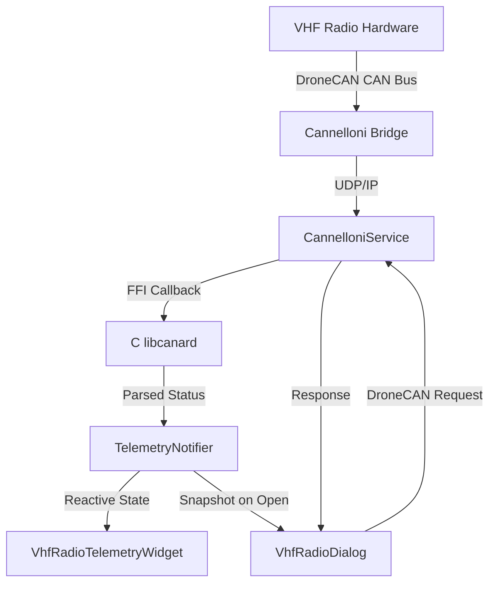

# VHF Radio Control & Monitoring

This document describes the VHF radio control and monitoring system in the Stork application, including DroneCAN message parsing, the reactive telemetry pipeline, the interactive control dialog, favorite frequencies management, and nearby frequency discovery.

---

## 1. Overview

The VHF Radio feature enables pilots to monitor and control aircraft communication radios (COM1, COM2, etc.) directly from the Stork application. The radio hardware is connected via a DroneCAN-enabled CAN bus, bridged to the device over UDP/IP using the Cannelloni protocol.



There are two primary data flows:

1. **Status (incoming)**: The radio periodically broadcasts `FastStatus` (ID 20122) and `FullStatus` (ID 20123) messages over DroneCAN. These are parsed by the native C layer and propagated to the Dart `TelemetryNotifier`, which reactively updates the overlay widget.

2. **Control (outgoing)**: When the user interacts with the VHF Radio dialog, DroneCAN service requests (ID 221) are sent to the radio node to change frequencies, adjust audio settings, or toggle features.

---

## 2. DroneCAN Messages

### 2.1. VhfRadioFastStatus (ID 20122)

A lightweight, frequently-broadcast message providing real-time radio state flags.

| Field | Bits | Description |
| :--- | :--- | :--- |
| `radio_instance` | 2 | Radio index (0 = COM1, 1 = COM2...) |
| `flags` | 8 | Bitmask: bit 0 = TX, bit 1 = RX, bit 2 = Dual Watch, bit 3 = General Error |

Parsed by [VhfRadioFastStatus](../../lib/core/native/dronecan/vhf_radio_fast_status.dart).

### 2.2. VhfRadioFullStatus (ID 20123)

A comprehensive status message broadcast less frequently (e.g., on state change or at a reduced cadence).

| Field | Bits | Description |
| :--- | :--- | :--- |
| `radio_instance` | 2 | Radio index (0 = COM1, 1 = COM2...) |
| `active_frequency_khz` | 18 | Active frequency in kHz (118000–136975) |
| `standby_frequency_khz` | 18 | Standby frequency in kHz (118000–136975) |
| `flags` | 8 | Bitmask (same as FastStatus) |
| `volume` | 7 | Volume level 0–100 (%) |
| `squelch` | 7 | Squelch level 0–100 (%) |
| `vox` | 7 | VOX threshold 0–100 (%) |
| `intercom` | 7 | Intercom volume 0–100 (%) |
| `mic_gain` | 4+7×N | Dynamic array of up to 8 microphone gain values (0–100 % each), prefixed with 4-bit length |
| `active_station_name` | 5+8×N | Active station name (ASCII, max 20 chars), prefixed with 5-bit length |
| `standby_station_name` | TAO (0–160) | Standby station name (ASCII, max 20 chars) — Tail Array Optimization, no length prefix |

All multi-field values use little-endian bit encoding via [BitReader](../../lib/core/native/bit_reader.dart). Parsed by [VhfRadioFullStatus](../../lib/core/native/dronecan/vhf_radio_full_status.dart).

### 2.3. VhfRadioControl (ID 221, Service)

A DroneCAN service (request/response) for controlling the radio. The request payload contains the action and parameters, while the response is a single status byte.

**Request payload:**

| Field | Bits | Description |
| :--- | :--- | :--- |
| `radio_instance` | 2 | Radio index (0 = COM1, 1 = COM2...) |
| `action` | 4 | Action to perform (see table below) |
| `level` | 7 | Level/percentage for the action (0–100) |
| `index` | 3 | Index for mic gain or other multi-value settings |
| `frequency_khz` | 18 | Frequency in kHz for set-frequency actions |
| `frequency_name` | TAO (0–160) | Station name (ASCII, max 20 chars) — Tail Array Optimization |

**Actions:**

| Constant | Value | Description |
| :--- | :---: | :--- |
| `actionFlip` | 1 | Swap active and standby frequencies |
| `actionDualToggle` | 2 | Toggle Dual Watch mode |
| `actionPttOn` | 3 | Press Push-To-Talk |
| `actionPttOff` | 4 | Release Push-To-Talk |
| `actionSetStandbyFreq` | 5 | Set the standby frequency |
| `actionSetActiveFreq` | 6 | Set the active frequency |
| `actionSetVolume` | 7 | Set volume level |
| `actionSetSquelch` | 8 | Set squelch level |
| `actionSetVox` | 9 | Set VOX threshold |
| `actionSetIntercom` | 10 | Set intercom volume |
| `actionSetMicGain` | 11 | Set microphone gain for a specific mic index |

The request is encoded using [BitWriter](../../lib/core/native/dronecan/vhf_radio_control.dart) and sent via `CannelloniService.sendRequest()` with a 1-second timeout. The response is a single byte (`0` = success, `1` = error).

---

## 3. Telemetry Integration

Incoming VHF radio status messages are parsed by the native C layer and forwarded to [TelemetryNotifier](../../lib/features/telemetry/presentation/providers/telemetry_provider.dart), which updates the reactive [TelemetryState](../../lib/features/telemetry/domain/models/telemetry_state.dart).

### 3.1. Telemetry Fields

The following radio fields are added to `TelemetryState`:

| Field | Type | Source Message |
| :--- | :--- | :--- |
| `radioActiveFrequency` | `DecayableField<int?>` | FullStatus |
| `radioStandbyFrequency` | `DecayableField<int?>` | FullStatus |
| `radioActiveStationName` | `DecayableField<String?>` | FullStatus |
| `radioStandbyStationName` | `DecayableField<String?>` | FullStatus |
| `radioFlags` | `DecayableField<int?>` | FastStatus / FullStatus |
| `radioInstance` | `DecayableField<int?>` | FastStatus / FullStatus |
| `radioNodeId` | `int?` | Set once on first radio message reception |
| `radioVolume` | `DecayableField<int?>` | FullStatus |
| `radioSquelch` | `DecayableField<int?>` | FullStatus |
| `radioVox` | `DecayableField<int?>` | FullStatus |
| `radioIntercom` | `DecayableField<int?>` | FullStatus |
| `radioMicGain` | `DecayableField<List<int>?>` | FullStatus |
| `isRadioSupported` | `bool` | Set to `true` on first radio message; persists across decay |

### 3.2. Decay Timeout

All radio telemetry fields use a **30-second decay timeout** (compared to 1.5–2 seconds for engine telemetry). This longer timeout is intentional — frequencies change infrequently during a flight, so brief network interruptions should not cause the radio widget to show an error state.

The `isRadioSupported` flag is set to `true` when the first radio message arrives and **never decays**. This keeps the radio widget visible even if the connection drops, showing a red error outline to indicate signal loss (identical to the engine telemetry pattern).

---

## 4. VHF Radio Telemetry Widget

The [VhfRadioTelemetryWidget](../../lib/features/telemetry/presentation/widgets/vhf_radio_telemetry_widget.dart) is a draggable/resizable overlay widget that displays real-time radio status on the map.

### 4.1. Visual Layout

```
┌─────────────────────────┐
│ 📻              TX RX DU│
│ 121.500                 │
│ Emergency (Guard)       │
│ ─────────────────────── │
│ 118.000                 │
│ Some Station            │
└─────────────────────────┘
```

- **Top row**: Radio icon and status flag indicators (TX = orange, RX = green, DUAL = cyan, ERR = red). Active flags have colored backgrounds.
- **Active frequency**: Large monospace display (22px × font scale) with station name below.
- **Divider**: Thin separator line.
- **Standby frequency**: Smaller monospace display (18px × font scale) in dimmed colors.

### 4.2. Interaction

- **Tap**: Opens the VHF Radio dialog if the radio is connected and has no error.
- **Disabled**: If `radioNodeId` is `null` (no radio detected) or an error flag is set, tap is disabled.
- **Card state**: Uses `ThresholdState.maxError` when disconnected or hardware error flag is set; `ThresholdState.operational` otherwise.

### 4.3. Flag Indicators

Each flag (TX, RX, DUAL, ERR) is rendered as a small badge:
- **Active**: Colored background + border with bold text.
- **Inactive**: Grey background + border with dimmed text.
- TX = orange (transmitting), RX = green (receiving), DUAL = cyan (dual watch mode), ERR = red (error or disconnected).

---

## 5. VHF Radio Dialog

The [VhfRadioDialog](../../lib/features/telemetry/presentation/widgets/vhf_radio_dialog.dart) is a full-featured control dialog opened by tapping the radio telemetry widget. It has two modes:

### 5.1. Quick Mode (Default)

The quick mode presents a simplified interface suitable for in-flight use:

- **Header**: Active and standby frequencies displayed side-by-side with a flip button.
- **Nearby Frequencies**: A one-shot lookup of airports and airspaces near the current GPS position, sorted by distance. Each frequency item can be tapped to show a popup menu for setting it as active or standby.
- **Favorite Frequencies**: User's saved frequencies with quick-set capability.
- **Manage Favorites button**: Opens the `ManageFavoritesDialog` for adding/removing/reordering favorites.
- **Advanced button**: Switches to advanced mode.
- **Error display**: Red banner for validation or DroneCAN errors.

### 5.2. Advanced Mode

The advanced mode provides full control over the radio:

- **Frequency Text Fields**: Editable fields for active and standby frequencies with MHz format validation (118.000–136.975, valid aviation offsets only). Checkmark buttons apply changes via DroneCAN.
- **Station Name Fields**: Editable station name text fields.
- **Flip Button**: Swaps active and standby frequencies via DroneCAN service request.
- **Audio Controls**: Collapsible section (toggle with arrow button) containing:
  - **Volume**: Slider 0–100%.
  - **Squelch**: Slider 0–100%.
  - **VOX**: Slider 0–100% (Voice-activated transmission threshold).
  - **Intercom**: Slider 0–100%.
  - **Mic Gain**: Sliders for up to 8 microphones (shown dynamically based on `micGain` array length).
  - Each audio control has an Apply checkmark button that sends the value via DroneCAN.
- **Back button**: Returns to quick mode.

### 5.3. State Management

The dialog state is managed by [VhfRadioDialogNotifier](../../lib/features/telemetry/presentation/providers/vhf_radio_dialog_notifier.dart) (a Riverpod family provider), which maintains:

- **Local UI state** (`VhfRadioDialogUiState`): Snapshot of frequencies, names, audio levels, and UI flags.
- **Dirty tracking**: The "saved" values track the last successfully sent values; the Apply buttons are enabled when current values differ from saved values.
- **Validation**: Frequencies are validated for aviation band range (118.000–136.975 MHz) and valid 25 kHz / 8.33 kHz channel offsets.
- **Error state**: Error messages are displayed in a red banner and cleared on next successful action.

The dialog intentionally captures a **snapshot** of radio state at open time and is **not reactively bound** to `telemetryProvider`. This prevents unnecessary widget rebuilds on every incoming telemetry frame (~100 ms cadence). Reopening the dialog picks up the latest values.

The `TextEditingController` instances are held in widget state (not in the notifier) because they are Flutter-lifecycle-bound resources requiring explicit `dispose()`. They are kept in sync with the notifier via `ref.listenManual`.

### 5.4. Frequency Validation

Aviation frequency validation in [VhfRadioDialogNotifier.parseAviationFrequency](../../lib/features/telemetry/presentation/providers/vhf_radio_dialog_notifier.dart) enforces:

1. **Format**: Exactly `XXX.XXX` (3 digits, dot, 3 digits).
2. **Range**: 118.000 MHz to 136.975 MHz.
3. **Channel spacing**: The last two digits (kHz offset) must be one of the valid aviation offsets:
   `{0, 5, 10, 15, 25, 30, 35, 40, 50, 55, 60, 65, 75, 80, 85, 90}` — supporting both 25 kHz and 8.33 kHz channel spacings.

---

## 6. Radio Popup Utility

[RadioPopupUtil](../../lib/features/telemetry/presentation/utils/radio_popup_util.dart) provides a reusable context menu for setting a frequency from any list (airport frequencies, favorites, etc.).

### Workflow

1. User taps on a frequency item in the dialog.
2. A popup menu appears at the tap position with two options: **Set as Active** or **Set as Standby**.
3. If the frequency is already set as active, the active option is hidden (and vice versa).
4. On selection, `VhfRadioController` sends the appropriate DroneCAN service request.
5. The dialog's `onFrequencySet` callback updates the local snapshot state.

The utility reads the current radio state from `telemetryProvider` and checks if the selected frequency is already active or standby to avoid redundant updates.

---

## 7. Favorite Frequencies

The [FavoriteFrequencies](../../lib/features/telemetry/presentation/providers/favorite_frequencies_provider.dart) Riverpod provider manages a persistent list of user-saved frequencies.

### Data Model

```dart
class FavoriteFrequency {
  final double mhz;   // Frequency in MHz (e.g., 121.500)
  final String name;  // Human-readable name (e.g., "Emergency (Guard)")
}
```

### Persistence

Frequencies are stored as JSON strings in `SharedPreferences` under the key `favorite_frequencies`. The provider uses `keepAlive: true` to survive navigation without reloading from disk.

### Default

On first launch, a single default entry is created: **121.500 MHz** — "Emergency (Guard)".

### Operations

- **Add**: Validates frequency format and aviation band range, then appends to the list.
- **Remove**: Removes by index.
- **Reorder**: Drag-and-drop reordering with index-based insert/remove.

### Manage Favorites Dialog

The [ManageFavoritesDialog](../../lib/features/telemetry/presentation/widgets/manage_favorites_dialog.dart) provides a full UI for managing the favorites list:

- **Add form**: Frequency text field (validated), name text field, and Add button.
- **Favorites list**: Reorderable list with drag handles, showing frequency and name.
- **Delete**: Swipe-to-dismiss or delete button on each item.

---

## 8. Nearby Frequencies

The [NearbyFrequencies](../../lib/features/telemetry/presentation/providers/nearby_frequencies_provider.dart) provider performs a one-shot lookup of aeronautical frequencies near the aircraft's current GPS position.

### Design Intent

This provider is intentionally **not reactively bound** to telemetry changes. The computation is database-heavy — it loads all airports and airspaces from the local SQLite database and calculates geodesic distances to the GPS position (and polygon distances for airspaces). Reactive re-evaluation on every GPS update (~1 Hz) would unnecessarily stress the main thread.

### Data Sources

1. **Airports**: Merged from the in-memory session cache (`airportMetadataCacheProvider`) and the offline SQLite database (`mapMetadataRepository.fetchAllFeaturesFromDb('apt')`).
2. **Airspaces**: Merged from the in-memory session cache (`airspaceMetadataCacheProvider`) and the offline SQLite database (`mapMetadataRepository.fetchAllFeaturesFromDb('asp')`). Only airspaces with at least one frequency are included.

### Distance Calculation

- **Airports**: Geodesic distance using `GeoUtils.distanceBetween()` (Haversine formula).
- **Airspaces**: Distance to the nearest polygon edge using `GeoUtils.distanceToPolygons()`. Airspaces that contain the current position return `0.0` distance.

### Results

The top 5 nearest airports and top 5 nearest airspaces (with frequencies) are returned, sorted by distance. Airspaces at `0.0` distance (containing the current position) are sorted alphabetically.

---

## 9. VHF Radio Controller

The [VhfRadioController](../../lib/features/telemetry/presentation/providers/vhf_radio_controller.dart) is a stateless Riverpod provider that encapsulates all DroneCAN service request logic for radio control.

### Methods

| Method | Action | DroneCAN Action |
| :--- | :--- | :---: |
| `setActiveFrequency` | Set the active frequency and station name | `actionSetActiveFreq` (6) |
| `setStandbyFrequency` | Set the standby frequency and station name | `actionSetStandbyFreq` (5) |
| `flipFrequencies` | Swap active and standby | `actionFlip` (1) |
| `toggleDualWatch` | Toggle Dual Watch mode | `actionDualToggle` (2) |
| `setVolume` | Set volume level (0–100) | `actionSetVolume` (7) |
| `setSquelch` | Set squelch level (0–100) | `actionSetSquelch` (8) |
| `setVox` | Set VOX threshold (0–100) | `actionSetVox` (9) |
| `setIntercom` | Set intercom volume (0–100) | `actionSetIntercom` (10) |
| `setMicGain` | Set microphone gain for a specific mic index (0–100) | `actionSetMicGain` (11) |

All methods construct a `VhfRadioControlRequest`, serialize it using `BitWriter`, and send it via `CannelloniService.sendRequest()`. Responses are validated — a non-zero status byte throws an exception.

---

## 10. Settings Integration

### 10.1. Radio Instance Selection

The radio instance is determined automatically from the incoming DroneCAN messages. The `radioInstance` field (0 = COM1, 1 = COM2) is extracted from both FastStatus and FullStatus messages.

### 10.2. Device Connection

The radio is accessed through the same Cannelloni bridge as other DroneCAN devices. No separate connection configuration is required — the radio node is discovered via the DroneCAN Dynamic Node ID Allocation (DNA) process described in the [Telemetry Architecture](../architecture/telemetry-architecture.md) document.

---

## 11. Source Files

| File | Purpose |
| :--- | :--- |
| `lib/core/native/dronecan/vhf_radio_control.dart` | DroneCAN service request/response message definition |
| `lib/core/native/dronecan/vhf_radio_fast_status.dart` | Fast status message parser (flags only) |
| `lib/core/native/dronecan/vhf_radio_full_status.dart` | Full status message parser (all fields) |
| `lib/core/services/cannelloni_service_io.dart` | Cannelloni service with `sendRequest()` support |
| `lib/features/telemetry/domain/models/telemetry_state.dart` | Telemetry state with radio fields |
| `lib/features/telemetry/presentation/providers/telemetry_provider.dart` | Telemetry notifier with radio decay fields |
| `lib/features/telemetry/presentation/providers/vhf_radio_controller.dart` | Radio control DroneCAN request provider |
| `lib/features/telemetry/presentation/providers/vhf_radio_dialog_notifier.dart` | Dialog state management |
| `lib/features/telemetry/presentation/providers/nearby_frequencies_provider.dart` | One-shot nearby frequency lookup |
| `lib/features/telemetry/presentation/providers/favorite_frequencies_provider.dart` | Persistent favorite frequencies |
| `lib/features/telemetry/presentation/widgets/vhf_radio_telemetry_widget.dart` | Map overlay radio widget |
| `lib/features/telemetry/presentation/widgets/vhf_radio_dialog.dart` | Main radio control dialog |
| `lib/features/telemetry/presentation/widgets/vhf_radio_dialog_quick_ext.dart` | Quick mode UI extension |
| `lib/features/telemetry/presentation/widgets/vhf_radio_dialog_advanced_ext.dart` | Advanced mode UI extension |
| `lib/features/telemetry/presentation/widgets/vhf_radio_dialog_lists_ext.dart` | Nearby/favorites list UI extension |
| `lib/features/telemetry/presentation/widgets/vhf_radio_dialog_audio_ext.dart` | Audio controls UI extension |
| `lib/features/telemetry/presentation/widgets/manage_favorites_dialog.dart` | Favorite frequencies management dialog |
| `lib/features/telemetry/presentation/utils/radio_popup_util.dart` | Frequency selection popup utility |
| `lib/features/map/domain/models/airspace_frequency.dart` | Airspace frequency data model |
| `lib/features/telemetry/domain/models/favorite_frequency.dart` | Favorite frequency data model |
